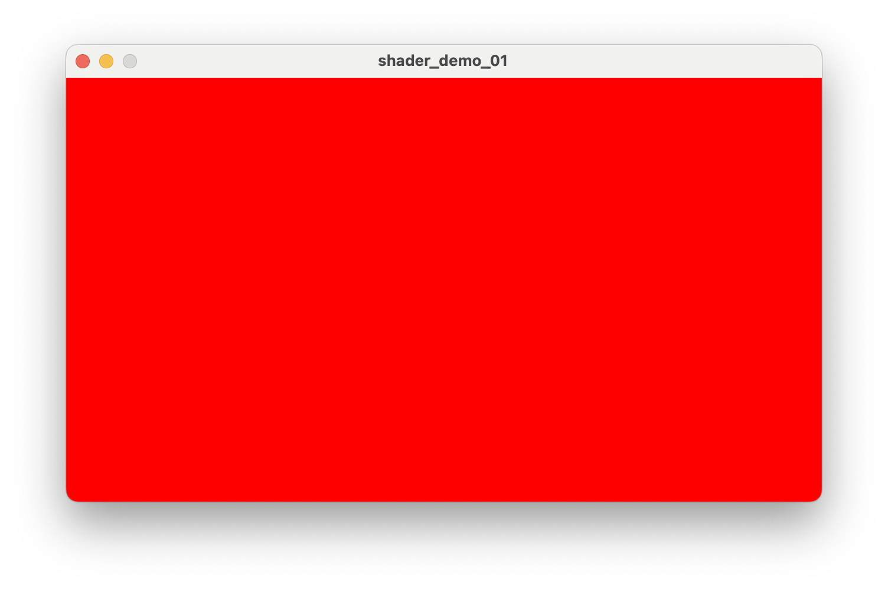
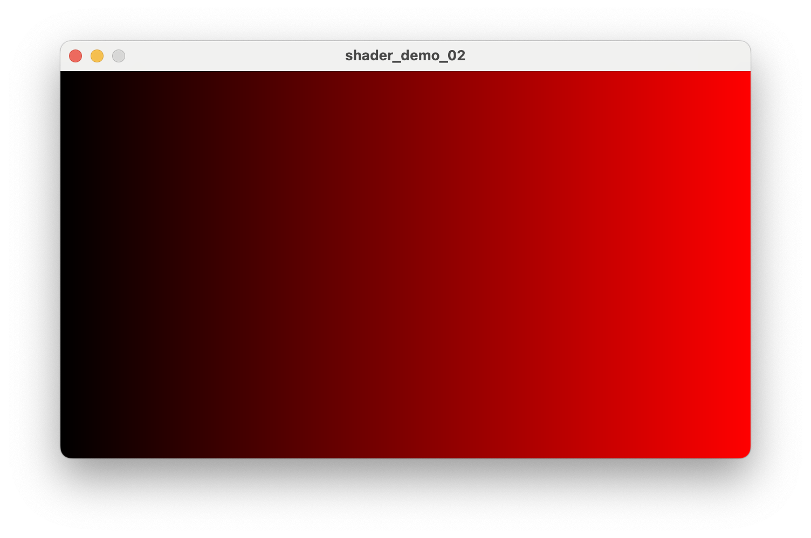
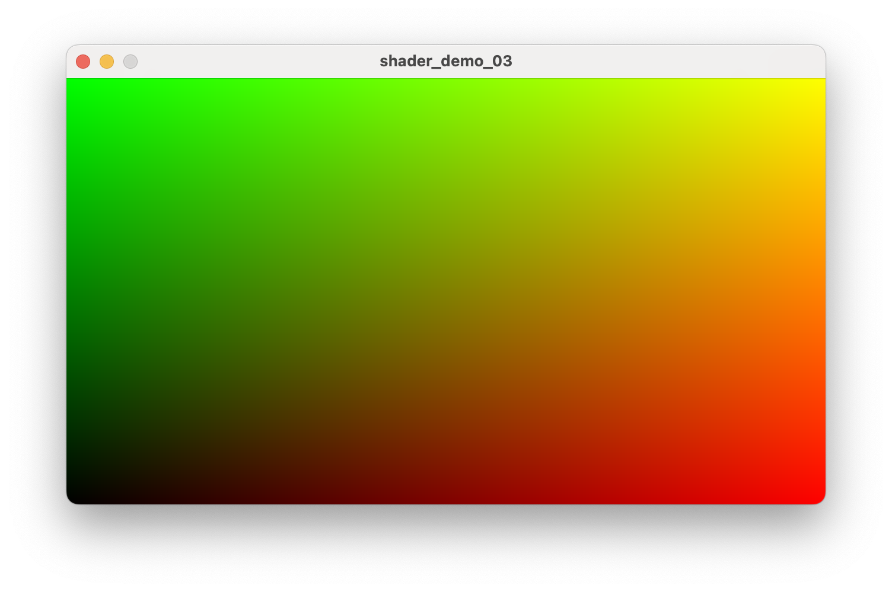

# PShader Tutorial

## Intro

Shaders, written in [GLSL](https://www.khronos.org/opengl/wiki/OpenGL_Shading_Language) (OpenGL Shading Language), provide many opportunities for exciting, powerful, and optimized graphics techniques that can expand creative possibilities and make common practical tasks easier and faster. These range from post-processing effects, advanced compositing, generative drawing, and custom control over the lighting, materials, and geometry of 3d shapes. 

Shaders are powerful and portable graphics programs that can run in Processing via the [PShader](https://processing.org/reference/PShader.html) object. These programs run on a computer’s GPU (Graphics Processing Unit), rather than the CPU (Central Processing Unit), which is where Java code is executed. Processing already takes advantage of the GPU in many ways, from loading a program's images into video RAM (VRAM), caching geometry (via the [PShape](https://processing.org/reference/PShape.html) object), and rendering geometric shapes and images to the screen, with functions like `rect()` and `image()`. Behind the scenes, Processing even uses a set of built-in shaders to accomplish much of this. So, while shaders may be a new concept, they are already an integral part of how Processing works.

GLSL is a “c-style language” ([1](https://www.khronos.org/opengl/wiki/OpenGL_Shading_Language)), and has a relatively small number of built-in data types and functions. Writing GLSL is certainly different than writing Java, but there is familiar-looking syntax when compared to Processing or p5.js code. Many other creative coding frameworks support shaders, so any efforts to learn them in Processing can be useful when programming in other environments!

There are many technical details about writing shader programs that aren't covered in this tutorial, because there are so many excellent educational resources on the internet. Primarily,, this tutorial wil show introductory examples to common uses of shaders in Processing.

## Writing Your First Shader

To write a shader:

* Create a new sketch in Processing and save it. This will create a new directory for your sketch
* Inside the sketch directory, create a new file called `shader.glsl`. Shaders can also have the file extensions `.frag` and `.vert`. To keep it simple, start with a single fragment shader, also known as a pixel shader  
  * ~~***\[HOW DO WE CREATE & OPEN THIS FILE IN THE IDE?\]***~~
    * ***SHADER MODE DOESN’T WORK IN PROCESSING 4.3.1***  
    * ***Would we need to suggest VS Code for now?***   
  * Install **Shader Mode** from the Modes manager, which will allow you to edit GLSL code in a new tab in the Processing IDE. To do this, click the dropdown button in the upper-right of the IDE, and select “Manage Modes…”. Then select “Shader Mode” and click “Install”.  
  * ~~
* Use `loadshader()` to load the GLSL program   
* Use `filter()` to apply the shader to the canvas

```java
PShader myShader;

void setup() {
  size(640, 360, P2D);
  myShader = loadShader("shader.glsl"); 
}

void draw() {
  filter(myShader);  
}
```

```glsl
void main() {
  gl_FragColor = vec4(1.0, 0.0, 0.0, 1.0);
}
```

The `loadShader()` function returns a PShader object, which is Processing’s representation of a shader that has been loaded from a GLSL source file. It can then be applied to the canvas whenever we want. Here’s an example of loading our first shader file, with the main sketch code, and the shader.glsl code. Please note that shaders only work in the `P2D` or `P3D` rendering modes.



That’s possibly the simplest shader that can be written in Processing! Hopefully, the sketch shows a red background. If not, check for errors in the console. Make sure that P2D or P3D mode is set in `size()`, and be aware that while most computers support shaders, not all of them do.

In the GLSL code, we see several things: 

* There must be a `void main()` function. This is like the `draw()` function in Processing, and is called automatically when `filter()` is called in a sketch. Next, the `gl_FragColor` variable is being set to a vec4 value. This is usually the last line in a shader’s `main()` function, and it *sets the output color of the pixel that the shader program is operating on*. More on this in a moment.   
* The `vec4` data type is like a PVector or an object or struct in other languages, where multiple values are contained in a single variable. A `vec4` variable stores (4) floating point numbers. Floating point numbers are simply numbers that can have a decimal point. While GLSL supports `int` values, most numeric values will likely be `float`s, and it’s important to understand that setting a float value must be done with a decimal point, which is why it looks like this: `vec4(1.0, 0.0, 0.0, 1.0)`. If an `int` value is passed into a `vec4` the program will likely crash, because the data types don’t match. For example, this would be invalid code: `vec4(1, 0, 0, 1)`.   
* Color components in Processing use a value range of 0-255, while in GLSL color values range from 0-1. In our code above, the red, green, blue, and alpha values are set the same way we would with `fill(255, 0, 0, 255)` in Processing code. The 4 function arguments in both cases are red, green, blue, and alpha.

## Parallel Computing

As mentioned, the shader program operates on individual pixels, which is why it’s often called a **pixel shader**. When using the **fragment shader** nomenclature, a "fragment" also refers to an individual pixel. This concept can be confusing, but it reveals the power and behavior of a GLSL program. If a sketch is 640 x 360 pixels, there are a total of 230,400 pixels, and the shader program operates on every single pixel *at the same time*. This is inherent to how the GPU functions, and is an example of [parallel computing](https://en.wikipedia.org/wiki/Parallel_computing). Machine Learning systems take advantage of this computing style, which is why GPUs are used for much more than just graphics. 

This parallel execution is very different than the way that shapes and colors are typically drawn in Processing, and the two styles can compliment each other with their unique strengths. Not only does a GLSL program run independently on each pixel, it also has very limited information to use when deciding what to do with that pixel. One of the challenges of learning shader programming is getting accustomed to this style of thinking, adopting new techniques to draw shapes, and learning how to make the best use of shaders' powerful features.

## A New Coordinate System

In the first example, all pixels were turned red, which is just like calling Processing’s `background()` function. But that was just a "hello world" type example. Let’s explore the coordinate system in a shader.

In our first sketch, the coordinate system starts from the top left at `0, 0`, and extends to the bottom right at `640, 360`. This tends to be how people think about coordinates on a digital screen - in pixel measurements. In GLSL however, it’s often the case that a normalized coordinate system is used, which means that no matter the pixel dimensions, the width of our canvas will always be 1, and the height will always be 1. So the left-most pixel has a coordinate of 0, and the right-most pixel has a coordinate of 1. While this can be a challenging shift in thinking, it can be quite helpful, because now our calculations can be a bit more flexible and agnostic to specific image sizes.

In most shader environments, the bottom-most pixel has a coordinate of 0, and the top-most pixel has a coordinate of 1. This is known as having a flipped (or inverted) y-coordinate relative to Processing and many other coordinate systems.

By default, a fragment shader provides its pixel’s position on the canvas via `vertTexCoord`. This is one of the only pieces of information that a shader provides by default. The `shader.glsl` code can be updated to explore this interesting new coordinate system:

```
varying vec4 vertTexCoord;

void main() {
  vec2 uv = vertTexCoord.xy;
  gl_FragColor = vec4(uv.x, 0.0, 0.0, 1.0);
}
```



In the updated shader code, notice some new things:

* The output is now drawing a black-to-red gradient, as the x coordinate is fed into the red color component of the `gl_FragColor` assignment. This is an example of normalized coordinate values playing nicely with normalized color values.
* `vertTexCoord` (shorthand for "vertex texture coordinate") is *the current pixel*’s location in the normalized coordinate system. This value will range from 0-1 for both x and y values. This variable is provided by Processing, and it always available in any shader.
* `vertTexCoord` is a `vec4`, but this code only uses the x and y coordinate values, which can be accessed by requesting the first two values in the `vec4`: `vertTexCoord.xy`, which returns a `vec2`. The x and y values are copied to a new `vec2` variable called `uv`.
* In addition to `vec2` and `vec4` data types, there’s also a `vec3` data type. Single float values are simply stored in a `float` data type, just like in Processing Java code.
* It’s worth noting that requesting a `vec2` from a `vec4` by calling `vertTexCoord.xy` is called [swizzling](https://www.khronos.org/opengl/wiki/Data_Type_(GLSL)#Swizzling). Values can even be requested in different orders, and using different property names. Since a `vec3` might be used as either an RGB color or an XYZ coordinate in a shader program, GLSL can use `.rgb` and `.xyz` interchangeably.
* `vertTexCoord` is defined as a `varying` variable, which means that its value was passed to the fragment shader from the vertex shader. This isn’t important for now, but can become important later when working with vertex shaders. It is interesting to know, however, that there is always a vertex shader that runs before the fragment shader, even if you're not using it. Processing provides a [default vertex shader](https://github.com/processing/processing4/tree/main/core/src/processing/opengl/shaders) behind the scenes if you don’t provide your own.  
* In the world of shaders, a pixel’s location (relative to the triangle that it's drawn onto) is called its [UV coordinate](https://en.wikipedia.org/wiki/UV_mapping), which has roots in the world of 3d modeling. Even in seemingly 2-dimensional shader programs, the graphics library is shading a polygon mesh behind the scenes, even if it's just two triangles that make a rectangle.
* UV coordinates are used to map textures onto polygons in Processing, and  which is why the `vertTexCoord` variable is named as such. The `u` and `v` are simply different names for the `x` and `y` coordinates of a texture. In Processing, this is similar to how the `texture()` function works with the `vertex()` function.

If the y coordinate is applied to the green color component, the result is a classic "UV map" that visualizes the pixel’s coordinate system in terms of color components. In more advanced shader programming, color data is often a way to store more generalized numeric data, but this is a good first look at visualizing the texture's data. 

```
varying vec4 vertTexCoord;

void main() {
  vec2 uv = vertTexCoord.xy;
  gl_FragColor = vec4(uv.x, uv.y, 0.0, 1.0);
}
```



By visualizing the coordinate system with color, the bottom-left origin is easy to see (zero red and zero green), and the top-right corner is represented by full red and green, which appears as yellow.

## Uniforms (Via Animation & Interactivity)

In the previous examples, the shader program was static, and the output color was always the same. However, shaders can be dynamic and interactive, which is where they really shine. To do this, we can use **uniforms**.

TODO: Either draw a circl or asplit the screen in half with a uniform coordinate, and then use the mouse position to change the color on each side of the screen. 

## Using Textures

Now that we’ve seen the coordinate system in action, we can take another step forward in shader world by using a texture. Let’s draw an image to the screen in our Processing code, and then manipulate the pixels to see one way that GPU-powered parallel processing can be a dramatic improvement to non-GPU techniques.

Let’s load an image in our Processing sketch and draw that to the screen, so there’s a texture to work with. Put an image file into the `/data` directory. In this example, the image is named `cool-cat.png`.

```
PImage myImage;
PShader myShader;

void setup() {
  size(640, 360, P2D);
  myImage = loadImage("cool-cat.png");
  myShader = loadShader("shader.glsl"); 
}

void draw() {
  image(myImage, 0, 0);
  filter(myShader);  
}
```

And in our shader, we can access the existing pixels that were drawn to the screen before we run our shader program by calling `filter()`. 

```
<!-- #define PROCESSING_TEXTURE_SHADER -->

varying vec4 vertTexCoord;
uniform sampler2D texture;

void main() {
  vec2 uv = vertTexCoord.xy;
  vec4 color = texture2D(texture, uv);
  gl_FragColor = vec4(color.r, color.r, color.r, 1.0);
}
```

In the updated shader code, there are some new concepts:

* ***\[NOT NEEDED?\]*** In the first line, we set a constant variable with `#define`. This helps Processing understand what we intend to do with our shader. Under the hood, Processing sends different data to your shader depending on which type of shader you say it is. Here, we’re telling processing that it’s a `PROCESSING_TEXTURE_SHADER`, and this will give us access to the existing **texture** of our sketch, which we can then manipulate. You can find a list of possible shader types here:   
  ***\[FIND A LINK TO THIS INFO\] \- The old shader tutorial had some info about this, and github would also have a list in the [source](https://github.com/processing/processing/blob/master/core/src/processing/opengl/PShader.java#L60-L77). But how to explain them all?***  
* There’s a new variable called `texture`, with a data type of `sampler2D`. This is the equivalent to a `PImage` in Processing \- it’s a representation of an image stored in memory. This variable is also defined as a `uniform`, which is a special kind of variable in a shader. A uniform is a piece of data that can be sent from the CPU program (Java) to the GPU program (GLSL). We’ll see more of this later, but for now, the `texture` variable is automatically handed to our GLSL program, simply by defining it in the shader. This is another place where Processing makes lots of connections behind the scenes. It’s also worth noting that in every coding environment where shaders are used, the “host” environment will generally do a lot of this behind-the-scenes work and connections to make shader programming a little easier.   
* There’s a new built-in GLSL function called `texture2D`, which takes two arguments: a `sampler2D` and a `vec2` location. This is very similar to Processing’s [`get()`](https://processing.org/reference/get_.html) function that retrieves a pixel’s color value at a specific coordinate in an image. This code is requesting the pixel color at the current location and storing its RGBA data in a `vec4` variable called `color`. In shaders, this is often called “texture sampling” or a “texture lookup”.  
* Finally, when setting the output color of our pixel to \``` gl_FragColor` ``, the code is using the sampled color to set the output RGB values, but only uses the red channel\! This essentially creates a grayscale version of the image that was drawn before the shader was applied. There’s so much fun to have with this technique, by swapping color channels, inverting them, or doing other kinds of color manipulation or remapping. 

There are lots of [examples](https://processing.org/tutorials/pixels/#our-second-image-filter-making-our-own-tint) of doing this kind of color manipulation in Processing using [`loadPixels()`](https://processing.org/reference/loadPixels_.html) and [`updatePixels()`](https://processing.org/reference/updatePixels_.html). However, the difference in performance is enormous. The shader version is far faster, especially for larger sketches. A sketch running at 1920x1080 has over 2 million pixels, and running a `for()` loop on the CPU to manipulate colors like this can be very slow. Since each pixel contains 4 values for the RGBA color components for all 2 million pixels, there’s around 8 million pieces of data to handle. If the program is expected to run at 60fps, this likely won’t work. In a shader, however, you might not notice any dip in performance. This is where the magic of shaders starts to reveal itself. Certain tasks, when offloaded to the GPU, can be tens or even thousands of times faster than doing the same thing on the CPU.

To examine a comparable program that generates the same image but on the CPU, here’s an example of looping over each pixel and setting the RGB color values to the red component:

```java
PImage myImage;

void setup() {
  size(640, 360, P2D);
  myImage = loadImage("cool-cat.png");
}

void draw() {
  image(myImage, 0, 0);
  loadPixels();
  for (int y = 0; y < height; y++) {
    for (int x = 0; x < width; x++) {
      int loc = x + y*width;
      float r = red(pixels[loc]);
      float g = green(pixels[loc]);
      float b = blue(pixels[loc]);
      pixels[loc] =  color(r,r,r);
    }
  }
  updatePixels();
}
```

***\[NOTE\]*** In testing on a MacBook Pro M1, the shader version can take \<1ms, while the CPU version can take 30ms if the canvas size is 1920x1080. The difference is less dramatic at smaller sizes.

***\[NOTE\]*** This is broken on Mac - create a bug report

## WIP Below ----------------------------------------

## Adding Uniforms

## ~~Post-Processing Shaders~~

~~The previous example showed one way of altering existing pixel data. There are a number of common effects, or filters, that we could apply using a similar technique of sampling and changing the current pixel color. Processing has a set of built-in filters that also use the [`filter()`](https://processing.org/reference/filter_.html) function, but we can make our own with new shaders. Here are a couple of examples:~~

- ***~~Vignette**~~*  
- ***~~Brightness**~~*  
- ***~~Tile**~~*

## Post-Processing Shaders


* Example:   
  * Time uniform to allow for movement or something else more explanatory  
  * interactive mouseX into a uniform, with one color on each side  
  * Texture2d for grabbing existing pixels and doing something with them  
* Explain: uniforms  
  * Shader can’t change at all on it’s own without at least one uniform (usually for *time*)  
  * Communication between CPU & GPU programs (aka Processing and Shader)  
  * Allows for interactivity   
* Note: filter() vs shader() behavior

## Comparing advanced texture mapping to shader drawing

- Zoom/tiling/paning with `texture()` and `vertex` vs doing it in a shader. There are good similarities here
- Displacement shader: 2 texture uniforms and reading one to apply to another
- Radial gradient comparison

## Drawing shapes?

When `rect()` is called in Processing, there’s no simple equivalent in GLSL. This is where SDFs come into play. If a GLSL program only knows what its coordinate is, a rectangle function has to check its coordinate’s distance against the boundary of the calculation of a rectangle.  

## Potential advanced topics

* Shaders can be applied to the main drawing window, or to a PGraphics instance  
* It is recommended that you use the loadShader() function instead of calling new PShader(), but this does open the door to more advanced options like shader compiling. Here be dragons
