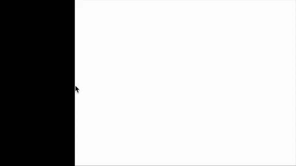

# PShader Tutorial

## Introduction: What are Shaders?

Shaders, written in [GLSL](https://www.khronos.org/opengl/wiki/OpenGL_Shading_Language) (OpenGL Shading Language), provide many opportunities for exciting, powerful, and optimized graphics techniques that can expand creative possibilities and make common practical tasks easier and faster. These range from post-processing effects, advanced compositing, generative drawing, and custom control over the lighting, materials, and geometry of 3d shapes. 

Shaders are powerful and portable graphics programs that can run in Processing via the [PShader](https://processing.org/reference/PShader.html) object. These programs run on a computer’s GPU (Graphics Processing Unit), rather than the CPU (Central Processing Unit), which is where Java code is executed. Processing already takes advantage of the GPU in many ways, from loading a program's images into video RAM (VRAM), caching geometry (via the [PShape](https://processing.org/reference/PShape.html) object), and rendering geometric shapes and images to the screen, with functions like `rect()` and `image()`. Behind the scenes, Processing even uses a set of built-in shaders to accomplish much of this. So, while shaders may be a new concept, they are already an integral part of how Processing works.

GLSL is a “c-style language” ([1](https://www.khronos.org/opengl/wiki/OpenGL_Shading_Language)), and has a relatively small number of built-in data types and functions. Writing GLSL is certainly different than writing Java, but there is familiar-looking syntax when compared to Processing or p5.js code. Many other creative coding frameworks support shaders, so any efforts to learn them in Processing can be useful when programming in other environments!

There are many technical details about writing shader programs that aren't covered in this tutorial, because there are so many excellent educational resources on the internet that explain deeper concepts. Primarily, this tutorial will show introductory examples to common uses of shaders in Processing.

## Writing a First Shader

To write a shader, follow these steps:

* Create a new sketch in Processing and save it. This will create a new directory for the sketch.
* Inside the sketch directory, create a new file called `shader.glsl`. Shaders can also have the file extensions `.frag` and `.vert`. To keep things simple, this tutorial starts with a single fragment shader, also known as a pixel shader.
  * ~~***\[HOW DO WE CREATE & OPEN THIS FILE IN THE IDE?\]***~~
    * ***SHADER MODE DOESN’T WORK IN PROCESSING 4.3.1***  
    * ***Would we need to suggest VS Code for now?***   
  * Install **Shader Mode** from the Modes manager, which allows editing GLSL code in a new tab in the Processing IDE. To do this, click the dropdown button in the upper-right of the IDE, and select “Manage Modes…”. Then select “Shader Mode” and click “Install”.  
  * ~~
* Use `loadShader()` to load the GLSL program.
* Use `filter()` to apply the shader to the canvas.

The `loadShader()` function returns a PShader object, which is Processing’s representation of a shader program that has been loaded from GLSL source files. It can then be applied to the graphics context in the `draw()` loop. The following is an example of loading a shader file in the sketch code, with the `shader.glsl` code below. Note that shaders only work in the `P2D` or `P3D` rendering modes, because these modes use OpenGL for graphics, and GLSL is a feature of OpenGL.

```java
PShader myShader;

void setup() {
  size(640, 360, P2D);
  myShader = loadShader("shader.glsl"); 
}

void draw() {
  filter(myShader);  
}
```

```glsl
void main() {
  gl_FragColor = vec4(1.0, 0.0, 0.0, 1.0);
}
```


This is possibly the simplest shader that can be written in Processing. When run, the sketch should show a red background. If the background is not red, check for errors in the console. Ensure that `P2D` or `P3D` mode is set in `size()`. While most computers support shaders, not all of them do.

In the GLSL code, note the following details:

* There must be a `void main()` function. This is similar to the `draw()` function in Processing, and is called automatically when `filter()` is called in a sketch. Next, the `gl_FragColor` variable is being set to a `vec4` value. This is usually the last line in a shader’s `main()` function, and it *sets the output color of the pixel that the shader program is operating on*.
* The `vec4` data type is like a `PVector` (or an object or struct in other languages), where multiple values are contained in a single variable. A `vec4` variable stores (4) floating point numbers. Floating point numbers are simply numbers that can have a decimal point. While GLSL supports `int` values, most numeric values will likely be `float`s, and it’s important to understand that setting a float value must be done with a decimal point, which is why it looks like this: `vec4(1.0, 0.0, 0.0, 1.0)`. Passing an `int` value into a `vec4` may cause the program to crash, because the data types don’t match. For example, this would be invalid code: `vec4(1, 0, 0, 1)`.
* Color components in Processing use a value range of 0-255, while in GLSL color values range from 0-1. In the code above, the red, green, blue, and alpha values are set similarly to `fill(255, 0, 0, 255)` in Processing. The 4 function arguments in both cases are red, green, blue, and alpha.

## Parallel Computing

The shader program operates on individual pixels, which is why it’s often called a **pixel shader**. When using the **fragment shader** nomenclature, a "fragment" also refers to an individual pixel. This concept can be confusing, but it reveals the power and behavior of a GLSL program. For a sketch of 640 x 360 pixels, there are a total of 230,400 pixels, and the shader program operates on every single pixel *at the same time*. This is inherent to how the GPU functions, and is an example of [parallel computing](https://en.wikipedia.org/wiki/Parallel_computing). Machine Learning systems take advantage of this computing style, which is why GPUs are used for much more than just graphics. 

This parallel execution differs from how shapes and colors are typically drawn in Processing, and the two styles can compliment each other with their unique strengths. Not only does a GLSL program run independently on each pixel, it also has very limited information to use when deciding what to do with that pixel. Learning shader programming involves adapting to this style of thinking, adopting new techniques to draw shapes, and learning how to make the best use of shaders' powerful features.

## A New Coordinate System

In the first example, all pixels were turned red, similar to calling Processing’s `background()` function. This serves as a basic introduction. The next step is to explore the coordinate system in a shader.

In the first sketch, the coordinate system starts from the top left at `0, 0`, and extends to the bottom right at `640, 360`. This is a common way to think about coordinates on a digital screen - in pixel measurements. However, GLSL often uses a normalized coordinate system, meaning that regardless of pixel dimensions, the canvas width and height are always 1. The left-most pixel has a coordinate of 0, and the right-most pixel has a coordinate of 1. This shift in thinking allows calculations to be more flexible and agnostic to specific image sizes.

In most shader environments, the bottom-most pixel has a coordinate of 0, and the top-most pixel has a coordinate of 1. This is known as having a flipped (or inverted) y-coordinate relative to Processing and many other coordinate systems.

By default, a fragment shader provides its pixel’s position on the canvas via `vertTexCoord`. This is one of the only pieces of information that a shader provides by default. Update the `shader.glsl` code to explore this coordinate system:

```glsl
varying vec4 vertTexCoord;

void main() {
  vec2 uv = vertTexCoord.xy;
  gl_FragColor = vec4(uv.x, 0.0, 0.0, 1.0);
}
```


Note the following details in the updated shader code:

* The output draws a black-to-red gradient, as the x coordinate is fed into the red color component of the `gl_FragColor` assignment. This demonstrates normalized coordinate values working with normalized color values.
* `vertTexCoord` (shorthand for "vertex texture coordinate") is *the current pixel*’s location in the normalized coordinate system. This value ranges from 0-1 for both x and y values. This variable is provided by Processing and is always available in any shader.
* `vertTexCoord` is a `vec4`, but this code only uses the x and y coordinate values, which can be accessed by requesting the first two values in the `vec4`: `vertTexCoord.xy`, which returns a `vec2`. The x and y values are copied to a new `vec2` variable called `uv`.
* In addition to `vec2` and `vec4` data types, there is also a `vec3` data type. Single float values are stored in a `float` data type, similar to Processing Java code.
* Requesting a `vec2` from a `vec4` by calling `vertTexCoord.xy` is called [swizzling](https://www.khronos.org/opengl/wiki/Data_Type_(GLSL)#Swizzling). Values can be requested in different orders and using different property names. Since a `vec3` might be used as either an RGB color or an XYZ coordinate in a shader program, GLSL can use `.rgb` and `.xyz` interchangeably.
* `vertTexCoord` is defined as a `varying` variable, which means that its value was passed to the fragment shader from the vertex shader. This is not critical for now, but becomes important when working with vertex shaders. There is always a vertex shader that runs before the fragment shader. Processing provides a [default vertex shader](https://github.com/processing/processing4/tree/main/core/src/processing/opengl/shaders) if one is not provided.
* In shader programming, a pixel’s location (relative to the triangle that it's drawn onto) is called its [UV coordinate](https://en.wikipedia.org/wiki/UV_mapping), which has roots in 3D modeling. Even in seemingly 2-dimensional shader programs, the graphics library shades a polygon mesh behind the scenes, even if it is just two triangles that make a rectangle.
* UV coordinates map textures onto polygons in Processing, which explains the name `vertTexCoord`. The `u` and `v` are simply different names for the `x` and `y` coordinates of a texture. In Processing, this is similar to how the `texture()` function works with the `vertex()` function.

Applying the y coordinate to the green color component results in a classic "UV map" that visualizes the pixel’s coordinate system in terms of color components. In more advanced shader programming, color data is often a way to store more generalized numeric data, but this provides a first look at visualizing the texture's data. 

```glsl
varying vec4 vertTexCoord;

void main() {
  vec2 uv = vertTexCoord.xy;
  gl_FragColor = vec4(uv.x, uv.y, 0.0, 1.0);
}
```


By visualizing the coordinate system with color, the bottom-left origin is easy to see: zero red and zero green, resulting in black, and the top-right corner is represented by full red and green, which appears as yellow.

## Uniforms for Animation and Interactivity

In the previous examples, the shader program was static; every time `filter()` is called, the output color is the same. However, shaders can be dynamic and interactive. In GLSL, almost any variable can be specified as a **uniform**, which adds the ability to **set** the value from Processing code. Uniforms are the only way to communicate to a shader program, as it has no other information about the world outside of its own code.

Most GLSL data types can be set as uniforms from Processing code, with the most common being `float`, `int`, `vec2/vec3/vec4`, and `sampler2D` (an image or texture representation). These values can be set in Processing code with the `set()` [method](https://processing.org/reference/PShader_set_.html) of the PShader object. Each uniform data type has its own `set()` method to properly convert Java values into GLSL values. The Processing framework provides this bridge to allow communication between the CPU and GPU. Examples of using the `set()` method include:

- `uniform int myInt`: `myShader.set("myInt", 2)`
- `uniform float myFloat`: `myShader.set("myFloat", 3.0)`
- `uniform vec2 myVec2`: `myShader.set("myVec2", x, y)`
- `uniform vec3 myVec3`: `myShader.set("myVec3", x, y, z)`
- `uniform vec4 myVec4`: `myShader.set("myVec4", x, y, z, w)`
- `uniform bool myBool`: `myShader.set("myBool", true)`
- `uniform sampler2D mySampler`: `myShader.set("mySampler", myImage)`

The following example uses the mouse position to change the color of the left and right sides of the screen. The `splitX` value is sent to the shader as a uniform, and the shader uses it to determine which color to draw on each side of the screen.

```java
PShader myShader;

void setup() {
  size(640, 360, P2D);
  myShader = loadShader("shader.glsl");
}

void draw() {
  // Normalize mouseX to 0-1 to match the shader's coordinate system,
  // and pass that value to the shader via the "splitX" uniform
  myShader.set("splitX", mouseX / float(width));
  filter(myShader);
}
```

In the shader code, the `splitX` value is accessed as a uniform:

```glsl
varying vec4 vertTexCoord;

// user-defined custom uniform variable
uniform float splitX;

void main() {
  vec2 uv = vertTexCoord.xy;
  // if the current pixel is to the left of the splitX position, make it black, otherwise make it white
  if (uv.x < splitX) {
    gl_FragColor = vec4(0.0, 0.0, 0.0, 1.0);
  } else {
    gl_FragColor = vec4(1.0, 1.0, 1.0, 1.0);
  }
}
```



Modify the code to use the Processing `millis()` function to animate the `time` uniform. Shaders often use a `time` uniform to animate different aspects of the output. Without a changing uniform value, the shader program cannot animate anything.

```java
void draw() {
  // count up from 0-1, looping every second
  myShader.set("time", (millis() / 1000.0) % 1.0);
}
```

```glsl
varying vec4 vertTexCoord;
uniform float time;

void main() {
  if (vertTexCoord.x < time) {
    gl_FragColor = vec4(0.0, 0.0, 0.0, 1.0);
  } else {
    gl_FragColor = vec4(1.0, 1.0, 1.0, 1.0);
  }
}
```

## GLSL Math Functions

<!-- 
- Show length/distance() to create a circle/vignette/radial gradient
- Show sin()/cos() to animate a circle in a circle
  - Also show an example of centered coordinate system with aspect ratio correction
- Show fract() to create a repeating pattern
-->


## Using Textures

With the coordinate system established, the next step involves using a texture. Drawing an image to the screen in Processing code and then manipulating the pixels demonstrates how GPU-powered parallel processing can improve upon non-GPU techniques.

Load an image in the Processing sketch and draw it to the screen to provide a texture to work with. Place an image file into the `/data` directory. In this example, the image is named `cool-cat.png`.

```java
PImage myImage;
PShader myShader;

void setup() {
  size(640, 360, P2D);
  myImage = loadImage("cool-cat.png");
  myShader = loadShader("shader.glsl"); 
}

void draw() {
  image(myImage, 0, 0);
  filter(myShader);  
}
```

In the shader, the existing pixels drawn to the screen before running the shader program can be accessed by calling `filter()`.

```glsl
<!-- #define PROCESSING_TEXTURE_SHADER -->

varying vec4 vertTexCoord;
uniform sampler2D texture;

void main() {
  vec2 uv = vertTexCoord.xy;
  vec4 color = texture2D(texture, uv);
  gl_FragColor = vec4(color.r, color.r, color.r, 1.0);
}
```

The updated shader code introduces new concepts:

<!-- 
* The first line sets a constant variable with `#define`. This helps Processing understand the intended use of the shader. Processing sends different data to the shader depending on the shader type. Defining `PROCESSING_TEXTURE_SHADER` provides access to the existing **texture** of the sketch. 
-->
* A new variable called `texture` uses the `sampler2D` data type. This is the equivalent to a `PImage` in Processing; it is a representation of an image stored in memory. This variable is also defined as a `uniform`. The `texture` variable is automatically passed to the GLSL program by defining it in the shader.
* A new built-in GLSL function called `texture2D` takes two arguments: a `sampler2D` and a `vec2` location. This is similar to Processing’s [`get()`](https://processing.org/reference/get_.html) function, which retrieves a pixel’s color value at a specific coordinate in an image. This code requests the pixel color at the current location and stores its RGBA data in a `vec4` variable called `color`. In shaders, this is often called “texture sampling” or a “texture lookup”.
* Finally, when setting the output color of the pixel to `gl_FragColor`, the code uses the sampled color to set the output RGB values, but only uses the red channel. This creates a grayscale version of the image drawn before the shader was applied. This technique allows for swapping color channels, inverting them, or performing other kinds of color manipulation or remapping. 

## Swizzling and Vector Component Shortcuts

In the previous example, the red channel of the sampled color is used for all three RGB components of the output color. This is done by accessing the `r` property of the `vec4` variable called `color`. Another method is **swizzling**, which allows multiple components of a `vec` to be accessed in different orders. There are multiple equivalent ways to set the output color to a grayscale RGB color using the red channel for all three components.

Each color component is set individually:

```glsl
gl_FragColor = vec4(color.r, color.r, color.r, 1.0);
```

A new `vec3` is created using the red channel, and then passed into the `vec4` output color. If a single float value is passed into a `vec3`, it is duplicated for all three components. If a `vec3` is passed into a `vec4`, only one additional `float` value is passed in to finish populating the 4 values. This is a common technique to convert between different `vec` data types, and demonstrates the flexibility of vector functions via [function overloading](https://en.wikipedia.org/wiki/Function_overloading).

```glsl
gl_FragColor = vec4(vec3(color.r), 1.0);
```

Another method uses [swizzling](https://www.khronos.org/opengl/wiki/Data_Type_(GLSL)#Swizzling). The following syntax requests the red channel three times in a row, which returns a `vec3` on the fly. This is then used to create the `vec4` output color. All three examples produce the same result.

```glsl
gl_FragColor = vec4(color.rrr, 1.0);
```

`vec4` variables can also be accessed with `.xyzw` (or even `.stpq`) notation, which is equivalent to `.rgba`. This is because a `vec4` might be used as either an RGBA color or an XYZW coordinate in a shader program. The following code produces the same result as the previous examples. Choosing the correct notation for the context of the code clarifies what the data is being used for (usually either colors or coordinates).

```glsl
gl_FragColor = vec4(color.xxx, 1.0);
gl_FragColor = vec4(color.sss, 1.0);
```

Another common use case of swizzling is changing the order of the vector components when accessing them. For example, to create a color that is green in the red channel, blue in the green channel, and red in the blue channel, use swizzling:

```glsl
gl_FragColor = vec4(color.gbr, 1.0);
```

Swizzling also allows for the manipulation of specific values within the vector. For example, the red and blue channels can be set to zero while keeping the green channel intact with a single line of code:

```glsl
color.rb *= 0.0;
gl_FragColor = vec4(color.rgb, 1.0);
```

### Comparing CPU vs GPU Pixel Manipulation Performance

There are many [examples](https://processing.org/tutorials/pixels/#our-second-image-filter-making-our-own-tint) of performing this kind of color manipulation in Processing using [`loadPixels()`](https://processing.org/reference/loadPixels_.html) and [`updatePixels()`](https://processing.org/reference/updatePixels_.html). However, the difference in performance is enormous. The shader version is significantly faster, especially for sketches with larger resolutions. A sketch running at 1920x1080 has over 2 million pixels, and running a `for()` loop on the CPU to manipulate colors can be very slow. Since each pixel contains 4 values for the RGBA color components for all 2 million pixels, there are around 8 million pieces of data to handle. If the program is expected to run at a high framerate, this approach may not work well. In a shader, however, there may be no noticeable dip in performance. This is where the power of shaders becomes apparent. Certain tasks, when offloaded to the GPU, can be tens or even thousands of times faster than performing the same task on the CPU.

To examine a comparable program that generates the same image but on the CPU, the following example loops over each pixel and sets the RGB color values to the red component:

```java
PImage myImage;

void setup() {
  size(640, 360, P2D);
  myImage = loadImage("cool-cat.png");
}

void draw() {
  image(myImage, 0, 0);
  loadPixels();
  for (int y = 0; y < height; y++) {
    for (int x = 0; x < width; x++) {
      int loc = x + y*width;
      float r = red(pixels[loc]);
      float g = green(pixels[loc]);
      float b = blue(pixels[loc]);
      pixels[loc] =  color(r,r,r);
    }
  }
  updatePixels();
}
```

In comparison, the shader-powered version of this program runs significantly faster:

```java
PImage myImage;
PShader myShader;

void setup() {
  size(640, 360, P2D);
  myImage = loadImage("cool-cat.jpg");
  myShader = loadShader("shader.glsl"); 
}

void draw() {
  image(myImage, 0, 0);
  filter(myShader);  
}
```

```glsl
varying vec4 vertTexCoord;
uniform sampler2D texture;

void main() {
  vec2 uv = vertTexCoord.xy;
  vec4 color = texture2D(texture, uv);
  gl_FragColor = vec4(color.r, color.r, color.r, 1.0);
}
```

This comparison highlights the fundamental advantage of shaders. By processing every pixel simultaneously, the GPU avoids the bottleneck of iterating through millions of array elements on the CPU. This efficiency allows for complex, real-time visual effects like blurs, distortions, and generative patterns that would otherwise be computationally prohibitive on the CPU.

***\[NOTE\]*** In testing on a MacBook Pro M1, the shader version can take \<1ms, while the CPU version can take 30ms if the canvas size is 1920x1080. The difference is less dramatic at smaller sizes.

***\[NOTE\]*** This is broken on Mac - create a bug report


## WHAT'S NEXT?

## WIP Below ----------------------------------------


## Adding Uniforms

## ~~Post-Processing Shaders~~

The previous example showed one way of altering existing pixel data. There are a number of common effects, or filters, that we could apply using a similar technique of sampling and changing the current pixel color. Processing has a set of built-in filters that also use the [`filter()`](https://processing.org/reference/filter_.html) function, but we can make our own with new shaders. Here are a couple of examples:

- ***~~Vignette**~~*  
- ***~~Brightness**~~*  
- ***~~Tile**~~*

## Post-Processing Shaders


* Example:   
  * Time uniform to allow for movement or something else more explanatory  
  * ~~interactive mouseX into a uniform, with one color on each side~~  
  * ~~Texture2d for grabbing existing pixels and doing something with them~~  
* Explain: uniforms  
  * ~~Shader can’t change at all on it’s own without at least one uniform (usually for *time*)~~
  * ~~Communication between CPU & GPU programs (aka Processing and Shader)~~
  * ~~Allows for interactivity and animation~~   
* Note: filter() vs shader() behavior

## Comparing advanced texture mapping to shader drawing

- Zoom/tiling/paning with `texture()` and `vertex` vs doing it in a shader. There are good similarities here
- Displacement shader: 2 texture uniforms and reading one to apply to another
- Radial gradient comparison

## Drawing shapes?

When `rect()` is called in Processing, there’s no simple equivalent in GLSL. This is where SDFs come into play. If a GLSL program only knows what its coordinate is, a rectangle function has to check its coordinate’s distance against the boundary of the calculation of a rectangle.  

## Vertex Shaders

* What we could explain:   
  * Colors/texturing  
  * Displacement (vertex manipulation, color)
  * Processing built-in attributes/uniforms for vertex shaders
  * Projection matrix / modelview matrix
  * How to connect a vertex shader to a fragment shader in Processing
    * varying variables to pass data between vertex and fragment shaders

## Potential advanced topics

* Shaders can be applied to the main drawing window, or to a PGraphics instance  
* It is recommended that you use the loadShader() function instead of calling new PShader(), but this does open the door to more advanced options like shader compiling. Here be dragons
