# PShader Tutorial

## Introduction: What are Shaders?

Shaders are powerful and portable graphics programs, written in [GLSL](https://www.khronos.org/opengl/wiki/OpenGL_Shading_Language) (OpenGL Shading Language). This language, and its integration into Processing and other graphical frameworks, provides endless opportunities for powerful and optimized graphics techniques that can expand creative possibilities and make common practical tasks easier and faster. These range from post-processing effects, advanced compositing, generative drawing, custom control over the geometry, materials, and lighting of 3D shapes, and beyond. 

Shaders run in Processing via the [PShader](https://processing.org/reference/PShader.html) object. These programs run on a computer’s GPU (Graphics Processing Unit), rather than the CPU (Central Processing Unit), which is where Java code is executed. Processing already takes advantage of the GPU in many ways, from loading a program's images (via PImage) into video RAM (VRAM), caching geometry (via the [PShape](https://processing.org/reference/PShape.html) object), and rendering geometric shapes and images to the screen, with functions like `rect()` and `image()`. Behind the scenes, Processing even uses a set of built-in shaders to accomplish much of its default behavior. So, while shaders may be a new concept to some, they are already an integral part of how Processing works "under the hood".

GLSL is a "C-style language" ([1](https://www.khronos.org/opengl/wiki/OpenGL_Shading_Language)) and has a relatively small number of built-in data types and functions. Writing GLSL is a different experience—and has different goals—than writing Java, but the syntax should look familiar when compared to Processing or p5.js code. Many other creative coding frameworks support shaders, so learning them in Processing provides a highly portable skill set. 

> The current version of Processing (4.x) uses OpenGL ES 2.0, a subset of the full OpenGL specification. Some features of GLSL may not be available, and the syntax may differ from other versions. The [OpenGL ES 2.0 specification](https://registry.khronos.org/OpenGL/specs/es/2.0/es_full_spec_2.0.pdf) is a useful reference when writing shaders for Processing.

This tutorial provides an entry-level introduction to using shaders in Processing. Many excellent educational resources on the internet explain deeper concepts, and there is a whole world of shader techniques to explore beyond this introduction. This tutorial explains basic shader concepts through examples and definitions to demonstrate common creative uses of shaders in Processing.

## Processing Shader Examples

In the Processing IDE, go to **File > Examples... > Topics > Shaders** to find a set of built-in shader examples that come with Processing. These examples cover a variety of shader techniques and are a great way to start exploring how shaders work in Processing. The full source code for these examples can also be found in the [processing-examples GitHub repository](https://github.com/processing/processing-examples/tree/main/Topics/Shaders), which makes the external shader files easy to browse.

## Writing a First Shader

***\[🚨🚨\]*** How do we write a shader? Which IDE do we point users to?
<!--
* ~~***\[HOW DO WE CREATE & OPEN THIS FILE IN THE IDE?\]***~~
  * ***SHADER MODE DOESN’T WORK IN PROCESSING 4.3.1***  
  * ***Would we need to suggest VS Code for now?***   
* Install **Shader Mode** from the Modes manager, which allows editing GLSL code in a new tab in the Processing IDE. To do this, click the dropdown button in the upper-right of the IDE, and select “Manage Modes…”. Then select “Shader Mode” and click “Install”.  
* 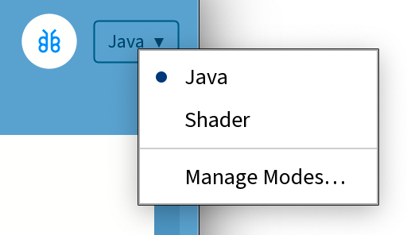~~
-->

To write a shader, follow these steps:

* Create a new sketch in Processing and save it. This will create a new directory for the sketch.
* Inside the sketch directory, create a new directory called `data`. Inside the `data` directory, create a new file called `shader.glsl`. Shaders can also have the file extensions `.frag` and `.vert`. To keep things simple, this tutorial starts with a single **fragment shader**, also known as a **pixel shader**.
* Use [`loadShader()`](https://processing.org/reference/loadShader_.html) to load the GLSL program.
* Use [`filter()`](https://processing.org/reference/filter_.html) to apply the shader to the canvas.

The `loadShader()` function returns a PShader object, which is Processing’s representation of a shader program that has been loaded from GLSL source files. It can then be applied to the graphics context in the `draw()` loop. The following is an example of loading a shader file in the sketch code, with the `shader.glsl` code below. Note that shaders only work in the `P2D` or `P3D` rendering modes, because these modes use OpenGL for graphics, and GLSL is a feature of OpenGL.

```java
PShader myShader;

void setup() {
  size(640, 480, P2D);
  myShader = loadShader("shader.glsl"); 
}

void draw() {
  filter(myShader);  
}
```

```glsl
void main() {
  gl_FragColor = vec4(1.0, 0.0, 0.0, 1.0);
}
```

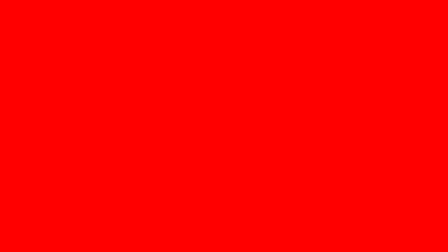

This is the simplest complete shader program that can be written in Processing. When it runs, the sketch fills the canvas with red. If the background is not red, check for errors in the console and ensure that `P2D` or `P3D` mode is set in `size()`. While most computers support shaders, not all do.

In the GLSL code, note the following details:

* There must be a `void main()` function. This is similar to the `draw()` function in Processing, and is called automatically when `filter()` is called in a sketch. Next, the `gl_FragColor` variable is being set to a `vec4` value. This is usually the last line in a shader’s `main()` function, and it *sets the output color of the pixel that the shader program is operating on*.
* The `vec4` data type is like a `PVector` (or an object or struct in other languages), where multiple values are contained in a single variable. A `vec4` variable stores (4) floating point numbers. Floating point numbers are simply numbers that can have a decimal point. While GLSL supports `int` values, most numeric values will likely be `float`s, and it’s important to understand that setting a float value must be done with a decimal point, which is why it looks like this: `vec4(1.0, 0.0, 0.0, 1.0)`. Passing an `int` value into a `vec4` may cause the program to crash, because the data types don’t match. For example, this would be invalid code: `vec4(1, 0, 0, 1)`, because `int` values aren't accepted in a `vec4`, which expects `float` arguments.
* Color components in Processing use a value range of 0-255, while in GLSL color values range from 0-1. In the code above, the red, green, blue, and alpha values would equate to `fill(255, 0, 0, 255)` in Processing. The four function arguments in both cases are red, green, blue, and alpha.

## Parallel Computing

The shader program operates on individual pixels, which is why it’s often called a **pixel shader**. When using the **fragment shader** nomenclature, a "fragment" also refers to an individual pixel. This concept can be confusing, but it reveals the power and behavior of a GLSL program. For a sketch of 640 x 360 pixels, there are a total of 230,400 pixels, and the shader program operates on every single pixel *at the same time*. This is inherent to how the GPU functions, and is an example of [parallel computing](https://en.wikipedia.org/wiki/Parallel_computing). Machine Learning systems take advantage of this computing style, which is why GPUs are now used for much more than just graphics. 

This parallel execution differs from how shapes and colors are typically drawn in Processing, and the two styles can compliment each other with their unique strengths. While a GLSL program runs independently on each pixel, it has very limited information to use when deciding what to do with that pixel. Learning shader programming involves adapting to this style of thinking, adopting new techniques to draw shapes, picking up some new terminology, and learning how and when to make use of shaders' powerful features.

## A New Coordinate System

In the first example, all pixels were turned red, similar to calling Processing’s `background()` function. This served as a basic introduction to a minimal shader program. The next step is to explore the coordinate system in a shader to position and manipulate pixels based on their location.

In the first sketch, the coordinate system starts from the top left at `0, 0`, and extends to the bottom right at `640, 360`. This is a common way to think about coordinates on a digital screen - in pixel measurements. However, GLSL often uses a normalized coordinate system, meaning that regardless of pixel dimensions, the canvas width and height are `1`. The left-most pixel has a coordinate of `0`, and the right-most pixel has a coordinate of `1`. This shift in thinking allows calculations to be more flexible and agnostic of specific image sizes. A shader shouldn't have to know the pixel dimensions of the canvas it is drawing to; it should be able to work on any size canvas.

In most shader environments, the bottom-most pixel has a coordinate of 0, and the top-most pixel has a coordinate of 1. This is known as having a flipped (or inverted) y-coordinate relative to Processing and many other coordinate systems.

By default, a fragment shader provides its pixel’s position on the canvas via `vertTexCoord`. This is one of the only pieces of information that a shader provides by default. Update the `shader.glsl` code to explore this coordinate system:

```glsl
varying vec4 vertTexCoord;

void main() {
  vec2 uv = vertTexCoord.xy;
  gl_FragColor = vec4(uv.x, 0.0, 0.0, 1.0);
}
```

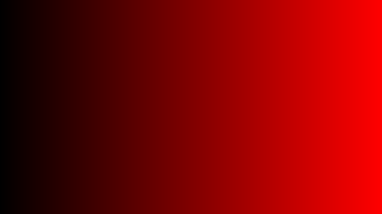

Note the following details in the updated shader code:

* The output draws a black-to-red gradient, as the x coordinate is fed into the red color component of the `gl_FragColor` assignment. This demonstrates normalized coordinate values working with normalized color values.
* `vertTexCoord` (shorthand for "vertex texture coordinate") is *the current pixel’s location* in the normalized coordinate system. This value ranges from 0-1 for both x and y values. This variable is provided by Processing and is always available in any shader.
* `vertTexCoord` is a `vec4`, but this code only uses the x and y coordinate values, which can be accessed by requesting the first two values in the `vec4`: `vertTexCoord.xy` - this returns a `vec2`. The x and y values are copied to a new `vec2` variable called `uv`.
* In addition to `vec2` and `vec4` data types, there is also a `vec3` data type. Single float values are stored in a `float` data type, similar to Processing Java code.
* Requesting a `vec2` from a `vec4` by calling `vertTexCoord.xy` is called [swizzling](https://www.khronos.org/opengl/wiki/Data_Type_(GLSL)#Swizzling). Vector components can be requested in different orders using different property names. Since a `vec3` might be used as either an RGB color or an XYZ coordinate in a shader program, GLSL can use `.rgba` and `.xyzw` interchangeably.
* `vertTexCoord` is defined as a `varying` variable, which means that its value was passed to the fragment shader from the vertex shader. This is not critical for now, but becomes important when working with vertex shaders. There is always a vertex shader that runs before the fragment shader. Processing provides a [default vertex shader](https://github.com/processing/processing4/tree/main/core/src/processing/opengl/shaders) if one is not provided.
* In shader programming, a pixel’s location (relative to the triangle that it's drawn onto) is called its [UV coordinate](https://en.wikipedia.org/wiki/UV_mapping), which has roots in 3D modeling. Even in seemingly 2-dimensional shader programs, the graphics library shades a polygon mesh behind the scenes, even if it is just two triangles that make a rectangle.
* UV coordinates map textures onto polygons in Processing, which explains the name `vertTexCoord`. The `u` and `v` are simply different names for the `x` and `y` coordinates of a texture. In Processing, this is similar to how the `texture()` function works with the `vertex()` function.

Applying the y coordinate to the green color component results in a classic "UV map" that visualizes the pixel’s coordinate system in terms of color components. In more advanced shader programming, color data is often a way to store more generalized numeric data, but this provides a first look at visualizing the texture's data. 

```glsl
varying vec4 vertTexCoord;

void main() {
  vec2 uv = vertTexCoord.xy;
  gl_FragColor = vec4(uv.x, uv.y, 0.0, 1.0);
}
```

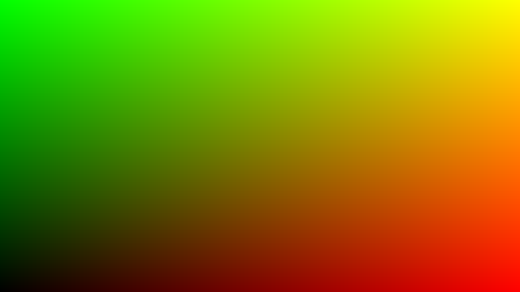

By visualizing the coordinate system with color, the bottom-left origin is easy to see: zero red and zero green resulting in black, and the top-right corner is represented by full red and green, which appears as yellow.

## Uniforms for Animation and Interactivity

In the previous examples, the shader program was static; every time `filter()` is called, the output color is the same. However, shaders can be dynamic and interactive. In GLSL, almost any variable can be specified as a **uniform**, which adds the ability to **set** the value from Processing code. Uniforms are the only way to communicate to a shader program, as it has no other information about the world outside of its own code.

Most GLSL data types can be set as uniforms from Processing code, with the most common being `float`, `int`, `vec2/vec3/vec4`, and `sampler2D` (an image or texture representation). These values can be set in Processing code with the `set()` [method](https://processing.org/reference/PShader_set_.html) of the PShader object. Each uniform data type has its own `set()` method to convert Java values into GLSL values. The Processing framework provides this bridge to allow communication from the CPU to the GPU. Examples of using the `set()` method include:

| Processing Code to Set Value | GLSL Uniform Declaration |
|--------------------------|------------------------------|
| `myShader.set("myInt", 2)` | `uniform int myInt` |
| `myShader.set("myFloat", 3.0)` | `uniform float myFloat` |
| `myShader.set("myVec2", x, y)` | `uniform vec2 myVec2` |
| `myShader.set("myVec3", x, y, z)` | `uniform vec3 myVec3` |
| `myShader.set("myVec4", x, y, z, w)` | `uniform vec4 myVec4` |
| `myShader.set("myBool", true)` | `uniform bool myBool` |
| `myShader.set("mySampler", myImage)` | `uniform sampler2D mySampler` |

The following example uses the mouse position to change the color of the left and right sides of the screen. The `splitX` value is sent to the shader as a uniform, and the shader uses it to determine which color to draw on each side of the screen.

```java
PShader myShader;

void setup() {
  size(640, 480, P2D);
  myShader = loadShader("shader.glsl");
}

void draw() {
  // Normalize mouseX to 0-1 to match the shader's coordinate system,
  // and pass that value to the shader via the "splitX" uniform
  myShader.set("splitX", mouseX / float(width));
  filter(myShader);
}
```

In the shader code, the `splitX` value is accessed as a uniform:

```glsl
varying vec4 vertTexCoord;

// user-defined custom uniform variable
uniform float splitX;

void main() {
  vec2 uv = vertTexCoord.xy;
  // if the current pixel is to the left of the splitX position, make it black, otherwise make it white
  if (uv.x < splitX) {
    gl_FragColor = vec4(0.0, 0.0, 0.0, 1.0);
  } else {
    gl_FragColor = vec4(1.0, 1.0, 1.0, 1.0);
  }
}
```

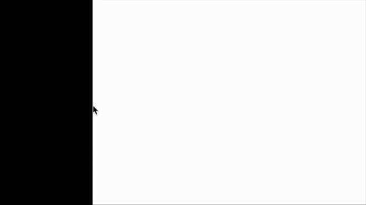

Modify the code to use the Processing `millis()` function to animate the `time` uniform. Shaders often use a `time` uniform to animate different aspects of the output. Without a changing uniform value, the shader program cannot animate anything.

```java
void draw() {
  // count up from 0-1, looping every second
  myShader.set("time", (millis() / 1000.0) % 1.0);
}
```

```glsl
varying vec4 vertTexCoord;
uniform float time;

void main() {
  if (vertTexCoord.x < time) {
    gl_FragColor = vec4(0.0, 0.0, 0.0, 1.0);
  } else {
    gl_FragColor = vec4(1.0, 1.0, 1.0, 1.0);
  }
}
```

## Using Textures

With the coordinate system established, the next step is to use a texture. Drawing an image to the screen in Processing code and then manipulating the pixels demonstrates how GPU-powered parallel processing can improve upon non-GPU techniques.

Load an image in the Processing sketch and draw it to the screen to provide a texture to work with. Place an image file into the `/data` directory. In this example, the image is named `cool-cat.png`.

```java
PImage myImage;
PShader myShader;

void setup() {
  size(640, 480, P2D);
  myImage = loadImage("cool-cat.png");
  myShader = loadShader("shader.glsl"); 
}

void draw() {
  image(myImage, 0, 0);
  filter(myShader);  
}
```

In the shader program, the existing pixels drawn to the canvas by `image()` can be accessed by calling `filter()`.

```glsl
varying vec4 vertTexCoord;
uniform sampler2D texture;

void main() {
  vec2 uv = vertTexCoord.xy;
  vec4 color = texture2D(texture, uv);
  gl_FragColor = vec4(color.r, color.r, color.r, 1.0);
}
```


The updated shader code introduces new concepts:

<!-- 
***\[🚨🚨\]***
* The first line sets a constant variable with `#define`. This helps Processing understand the intended use of the shader. Processing sends different data to the shader depending on the shader type. Defining `PROCESSING_TEXTURE_SHADER` provides access to the existing **texture** of the sketch. 
-->
* A new variable called `texture` uses the `sampler2D` data type. This is the equivalent to a `PImage` in Processing; it is a representation of an image stored in memory. This variable is also defined as a `uniform`. The `texture` variable is automatically passed to the GLSL program by defining it in the shader and calling `filter()` in Processing code. More images can be sent to the shader by defining additional `sampler2D` uniforms and using the [`set()`](https://processing.org/reference/PShader_set_.html) method in Processing code.
* A new built-in GLSL function called `texture2D` takes two arguments: a `sampler2D` and a `vec2` location. This is similar to Processing’s [`get()`](https://processing.org/reference/get_.html) function, which retrieves a pixel’s color value at a specific coordinate in an image. This code requests the pixel color at the current location and stores its RGBA data in a `vec4` variable called `color`. In shaders, this is often called “texture sampling” or a “texture lookup”.
* Finally, when setting the output color of the pixel to `gl_FragColor`, the code uses the sampled color to set the output RGB values, but only uses the red channel. This creates a grayscale version of the image drawn before the shader was applied. This technique allows for swapping color channels, inverting them, or performing other kinds of color manipulation or remapping. 

## Swizzling and Vector Component Shortcuts

In the previous example, the red channel of the sampled color is used for all three RGB components of the output color. This is done by accessing the `r` property of the `vec4` variable called `color`. Another method is **swizzling**, which allows multiple components of a `vec` to be accessed in different orders. There are multiple equivalent ways to set the output color to a grayscale RGB color using the red channel for all three components.

Each color component is set individually:

```glsl
gl_FragColor = vec4(color.r, color.r, color.r, 1.0);
```

A new `vec3` is created using the red channel, and then passed into the `vec4` output color. If a single float value is passed into a `vec3`, it is duplicated for all three components. If a `vec3` is passed into a `vec4`, only one additional `float` value is passed in to finish populating the 4 values. This is a common technique to convert between different `vec` data types, and demonstrates the flexibility of vector functions via [function overloading](https://en.wikipedia.org/wiki/Function_overloading).

```glsl
gl_FragColor = vec4(vec3(color.r), 1.0);
```

Another method uses [swizzling](https://www.khronos.org/opengl/wiki/Data_Type_(GLSL)#Swizzling). The following syntax requests the red channel three times in a row, which returns a `vec3` on the fly. This is then used to create the `vec4` output color. All three examples produce the same result.

```glsl
gl_FragColor = vec4(color.rrr, 1.0);
```

`vec4` variables can also be accessed with `.xyzw` (or even `.stpq`) notation, which is equivalent to `.rgba`. This is because a `vec4` might be used as either an RGBA color or an XYZW coordinate in a shader program. The following code produces the same result as the previous examples. Choosing the correct notation for the context of the code clarifies what the data is being used for (usually either colors or coordinates).

```glsl
gl_FragColor = vec4(color.xxx, 1.0);
gl_FragColor = vec4(color.sss, 1.0);
```

Another common use case of swizzling is changing the order of the vector components when accessing them. For example, to create a color that is green in the red channel, blue in the green channel, and red in the blue channel, use swizzling:

```glsl
gl_FragColor = vec4(color.gbr, 1.0);
```

Swizzling also allows for the manipulation of specific values within the vector. For example, the red and blue channels can be set to zero while keeping the green channel intact with a single line of code:

```glsl
color.rb *= 0.0;
gl_FragColor = vec4(color.rgb, 1.0);
```

## Comparing CPU vs GPU Pixel Manipulation Performance

There are many [examples](https://processing.org/tutorials/pixels/#our-second-image-filter-making-our-own-tint) of performing this kind of color manipulation in Processing using [`loadPixels()`](https://processing.org/reference/loadPixels_.html) and [`updatePixels()`](https://processing.org/reference/updatePixels_.html). However, the difference in performance can be enormous. The shader version is significantly faster, especially for sketches with larger resolutions. A sketch running at 1920×1080 contains more than 2 million pixels, and running a `for()` loop on the CPU to manipulate colors can be very slow. Since each pixel contains four values for the RGBA color components, there are around 8 million pieces of data to handle for all 2 million pixels. If the program is expected to run at a high framerate, this approach may not work well. In a shader, however, this graphical operation may have no noticeable impact on performance. This is where the power of shaders becomes apparent—certain tasks, when offloaded to the GPU, can be tens or even thousands of times faster than performing the same task on the CPU.

To examine a comparable program that generates the same image via the CPU or GPU, the following example loops over each pixel and sets the green color value to the red component, and sets the red and blue channels to zero:

```java
PImage myImage;

void setup() {
  size(640, 480, P2D);
  pixelDensity(1);
  myImage = loadImage("cool-cat.png");
}

void draw() {
  image(myImage, 0, 0);
  loadPixels();
  for (int y = 0; y < height; y++) {
    for (int x = 0; x < width; x++) {
      int loc = x + y*width;
      float r = red(pixels[loc]);
      pixels[loc] =  color(0, r, 0); // set green channel to red value
    }
  }
  updatePixels();
}
```

In comparison, the shader-powered version of this program runs significantly faster, especially at higher resolutions, when the number of pixels increases dramatically:

```java
PImage myImage;
PShader myShader;

void setup() {
  size(640, 480, P2D);
  myImage = loadImage("cool-cat.jpg");
  myShader = loadShader("shader.glsl"); 
}

void draw() {
  image(myImage, 0, 0);
  filter(myShader);  
}
```

```glsl
varying vec4 vertTexCoord;
uniform sampler2D texture;

void main() {
  vec2 uv = vertTexCoord.xy;
  vec4 color = texture2D(texture, uv);
  gl_FragColor = vec4(0., color.r, 0., 1.);
}
```

Both approaches look exactly the same, but the performance difference is substantial.

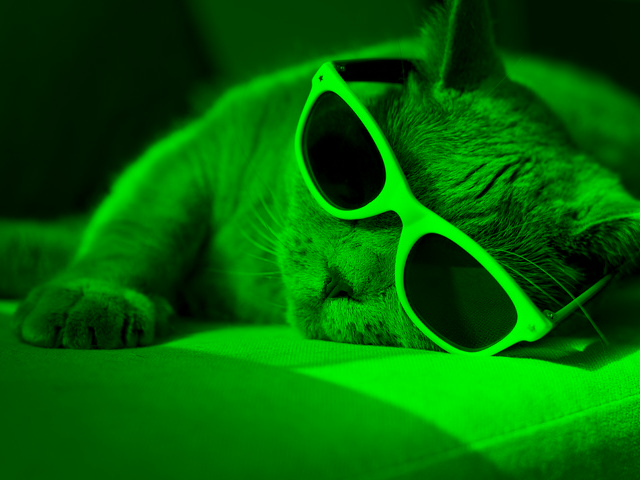

This comparison highlights a great advantage of shaders. By processing every pixel simultaneously, the GPU avoids the bottleneck of sequentially iterating through millions of array elements on the CPU. This efficiency allows for complex real-time visual effects like blurs, distortions, and generative patterns that could be prohibitively slow on the CPU, especially at larger resolutions.

<!--
***\[🚨🚨\]*** In testing on a MacBook Pro M1, the shader version can take \<1ms, while the CPU version can take 30ms if the canvas size is 1920x1080. The difference is less dramatic at smaller sizes.
-->

## Post-Processing Shaders

Post-processing effects are among the most compelling reasons to use shaders, and the above examples have introduced the concept. By treating the entire rendered sketch as an input texture, shaders can apply global effects like color correction and edge detection or more artistic effects like distortion or glitches. While Processing includes default filters via the `filter()` function (such as `BLUR`, `INVERT`, and `THRESHOLD`), custom shaders offer limitless creative control.

Here are some examples of post-processing effects that can be achieved with shaders in Processing.

### Example 1: Brightness

This simple example uses a custom `brightness` uniform to adjust the RGB values of the texture. 

**Processing Code:**
```java
PShader myShader;
PImage img;

void setup() {
  size(640, 480, P2D);
  img = loadImage("cool-cat.jpg");
  myShader = loadShader("brightness.glsl");
}

void draw() {
  // Draw a scene to be processed
  image(img, 0, 0);

  // Map mouseX to a brightness value between 0.0 (black) and 2.0 (2x brightness)
  float brightVal = map(mouseX, 0, width, 0.0, 2.0);
  myShader.set("uBrightness", brightVal);
  filter(myShader);
}
```

**Shader Code (`brightness.glsl`):**
```glsl
varying vec4 vertTexCoord;
uniform sampler2D texture;
uniform float uBrightness;

void main() {
  // Sample the texture at the given texture coordinates
  vec4 color = texture2D(texture, vertTexCoord.xy);

  // Multiply the RGB color by the brightness uniform, but leave alpha unchanged
  gl_FragColor = vec4(color.rgb * uBrightness, color.a);

  // Try changing just one color component for interesting effects
  // gl_FragColor = vec4(color.r * uBrightness,  color.g, color.b, color.a);
}
```

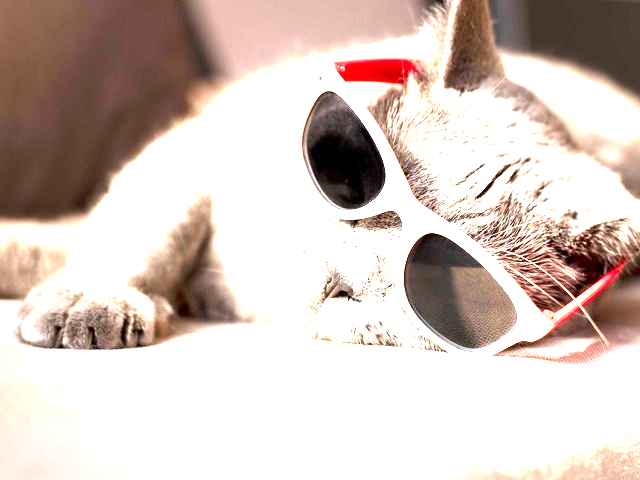

### Example 2: Vignette

A vignette effect darkens the edges of an image. This is achieved by calculating the distance of the current pixel from the center of the screen, and using that distance to darken the pixels towards the edges of the canvas.

**Shader Code (`vignette.glsl`):**
```glsl
uniform sampler2D texture;
varying vec4 vertTexCoord;

void main() {
  // Get the UV coordinates and sample the texture
  vec2 uv = vertTexCoord.xy;
  vec4 color = texture2D(texture, uv);

  // Calculate this pixel's distance from the center (0.5, 0.5)
  vec2 center = vec2(0.5, 0.5);
  float dist = distance(uv, center);

  // Invert the distance so the center is kept to the 
  // original color (by multiplying by 1), and edges 
  // are darker by multiplying downward with distance.
  float vignette = 1.0 - (dist * 1.5);

  gl_FragColor = vec4(color.rgb * vignette, 1.0);
}
```


### Example 3: Tiling

Shaders can also manipulate *where* a texture is sampled from. By modifying the original UV coordinates before sampling the texture, the image can be repeated or distorted. This is sometimes called domain warping. The GLSL function `fract()` returns only the fractional part of a number (e.g., `fract(1.5)` returns `0.5`), which is comparable to the modulus operator `%` that's commonly used in Java and other languages on the CPU.

**Shader Code (`tile.glsl`):**
```glsl
uniform sampler2D texture;
varying vec4 vertTexCoord;
uniform float uTiles;

void main() {
  vec2 uv = vertTexCoord.xy;
  
  // Multiply UVs by the number of tiles (e.g., 0-1 becomes 0-4)
  // Then take the fractional part to reset the range to 0-1 four times
  vec2 tiledUV = fract(uv * uTiles);
  
  vec4 color = texture2D(texture, tiledUV);
  gl_FragColor = color;
}
```

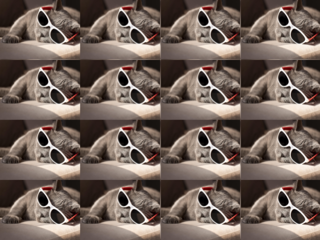


### Example 4: Displacement

Like the tiling example, UV coordinates can be modified *before* sampling the texture. In this case, a sine wave distortion is applied to the UV coordinates to create a wavy effect. A `phase` uniform is used to animate the pixel displacement over time.

**Shader code (`displace.glsl`):**
```glsl
uniform sampler2D texture;
varying vec4 vertTexCoord;
uniform float uPhase;

void main() {
  vec2 uv = vertTexCoord.xy;
  
  // Apply a sine wave distortion to the UV coordinates
  // When a float is multiplied by a vec2, it multiplies both components
  float frequency = 6.0;
  float amp = 0.1;
  vec2 displace = vec2(
    cos(uPhase + uv.y * frequency), 
    sin(uPhase + uv.x * frequency)
  ); 
  uv += displace * amp;

  // sample the color from the texture with the warped UVs
  gl_FragColor = texture2D(texture, uv);
}
```


These are just a small sample of post-processing effects that can be created with shaders. The code here is simple and efficient enough that multiple shaders can be applied in real-time to create complex visual styles without much of a performance impact. Try loading multiple shaders and applying them in sequence with multiple calls to `filter()`.

### A note about `textureWrap()`

By default, when UV coordinates extend beyond the normalized 0-1 range, the `texture2D()` function uses the color of the nearest edge pixel. However, sometimes it's desirable to have the texture repeat instead of the default "clamping" behavior. To achieve this, call `textureWrap(REPEAT)`, which switches from clamping to repeating the texture. This is an example of how CPU-side configuration in Processing can change the global drawing context and affect GLSL behavior.

```java
PImage img;
PShader uvRepeatShader;

void setup() {
  size(640, 480, P2D);
  img = loadImage("cool-cat.jpg");
  uvRepeatShader = loadShader("uv-adjust.glsl");
}

void draw() {
  // Alternate between REPEAT and CLAMP every 60 frames
  if(frameCount % 120 < 60) {
    // When UV coordinates go outside 0.0 - 1.0 range, repeat the texture.
    // The UV coords now behave like modulo in Java, or fract() in glsl
    textureWrap(REPEAT);
  } else {
    // default is CLAMP
    textureWrap(CLAMP); 
  }

  // draw a scene to be post-processed
  image(img, 0, 0);
  
  // adjust UVs to show repeating vs clamping behavior
  float mouseOffsetX = map(mouseX, 0, width, 1.0, -1.0);
  float mouseOffsetY = map(mouseY, 0, height, -1.0, 1.0);
  uvRepeatShader.set("uMouseOffset", mouseOffsetX, mouseOffsetY);
  filter(uvRepeatShader);
}
```

```glsl
varying vec4 vertTexCoord;
uniform sampler2D texture;
uniform vec2 uMouseOffset;

void main() {
  // Get the UV coordinates from the vertex shader
  // and adjust the UV coordinates based on the mouse position
  vec2 uv = vertTexCoord.xy + uMouseOffset;
  // Sample the texture at the adjusted texture coordinates
  vec4 color = texture2D(texture, uv);
  // Multiply the RGB color by the brightness uniform, but leave alpha unchanged
  gl_FragColor = color;
}
```

_Result of `textureWrap(CLAMP)`_:


_Result of `textureWrap(REPEAT)`_:

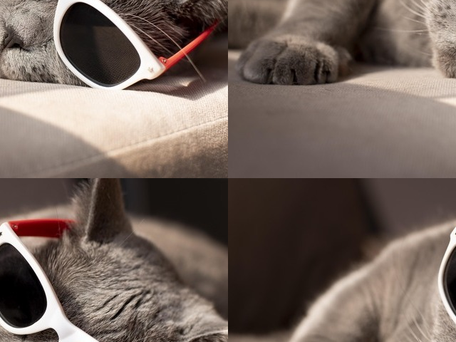


## Using `shader()` for more control

The `filter()` function applies a shader to the entire canvas as a "screen space" post-processing effect. In this situation, the shader's UV coordinates are normalized from 0.0-1.0 across the entire canvas, and this is a great approach for generating full-canvas generative graphics or post-processing effects.

Processing also provides the `shader()` function, which allows for more targeted control over where and how shaders are applied. This function can be used to apply shaders to specific geometry rather than the entire screen. Much like the `fill()` or `strokeWeight()` functions, calling `shader()` sets the current shader for all subsequent drawing operations until another shader is set or the custom shader is revoked by calling `resetShader()`. This is akin to using `push()` and `pop()` for styles, but specifically for shaders. Unexpected results may occur if `shader()` is called without resetting it, so it's good practice to always call `resetShader()` after drawing with a custom shader.

The most basic use of `shader()` is to apply a shader to shapes drawn with functions like `image()`, `rect()`, or custom geometry created with `beginShape()`, `vertex()`, and `endShape()`. When a shader is applied in this way, the UV coordinates in the shader are directly mapped to the shape's vertices, which have their own UV coordinates. `image()`  and `rect()`, for example, have default coordinates (like calling `filter()` on the entire canvas), but these coordinates are contained within the shape's bounds, wherever it's drawn on-screen. In the following example, the shader is only applied within the image boundaries, wherever it is drawn on the canvas:

```java
PImage img;
PShader myShader;

void setup() {
  size(640, 480, P2D);
  img = loadImage("cool-cat.jpg");
  myShader = loadShader("shader.glsl");
}

void draw() {
  background(255, 0, 0);
  imageMode(CENTER);

  // Set the shader on the drawing context 
  shader(myShader);

  // Draw an image - the shader will adjust the way it's drawn
  // The `texture` uniform in the shader is automatically set to the PImage
  image(img, mouseX, mouseY, img.width/2, img.height/2);

  // reset the shader
  resetShader();
}
```

```glsl
varying vec4 vertTexCoord;
uniform sampler2D texture;

void main() {
  // sample color from the image being drawn
  vec2 uv = vertTexCoord.xy;
  vec4 color = texture2D(texture, uv);

  // Set alpha based on red channel, which makes darker pixels more transparent
  color.a = color.r; 
  gl_FragColor = color;
}
```

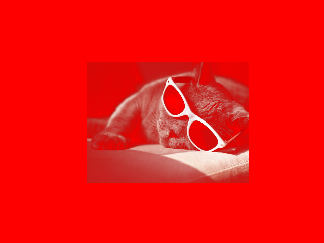


## More on UV coordinates

As noted previously, every shader in Processing is handed `vertTexCoord`, which allows the shader to know how to draw pixels on screen based on where the shape's vertices are. Typically, for rectangular shapes, these UV coordinates are normalized to the four corners of the shape. By using `beginShape()`, `vertex()`, and `endShape()`, Processing allows for custom UV coordinates to be specified as vertices are defined. These custom UV coordinates are automatically passed from the CPU to the shader via `vertTexCoord`, which allows for more customization with how an image is applied to the geometry.

Consider this example of custom UV coordinates with `beginShape()` and `vertex()` without a shader. The result mimics the `tiling.glsl` post-processing shader example, but this time the tiling behavior is specified on the CPU by setting custom UV coordinates for each vertex of the shape rather than inside the shader. This exemplifies the connection between geometry data created in Java and how that data is used, opening the door for further manipulation on the GPU via shaders.

```java
PImage img;

void setup() {
  size(640, 480, P2D);
  img = loadImage("cool-cat.jpg");
}

void draw() {
  background(0);
  
  // Specify custom UV coordinates for each vertex
  // Use normalized coordinates (0-1), to match GLSL
  textureMode(NORMAL); 
  // set UV coords to repeat
  textureWrap(REPEAT); 
    
  // draw tiled image via UV multiplication
  // https://processing.org/reference/texture_.html
  float numTiles = map(mouseX, 0, width, 1, 10);
  beginShape();
  texture(img);
  vertex(0, 0, 0, 0);
  vertex(width, 0, numTiles, 0);
  vertex(width, height, numTiles, numTiles);
  vertex(0, height, 0, numTiles);
  endShape();
}
```

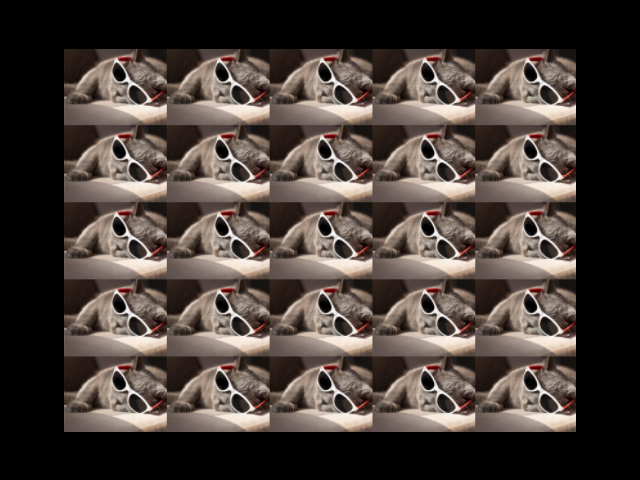

The following example breaks out of the rectangle shape by using custom UV coordinates with a circular shape. Using `vertex()`, a circular shape is created with UV coordinates corresponding to the circular geometry. This circle displays a cutout of the original image due to the custom UV coordinates that sample a circle from the image. The UV coordinates are then displaced in the shader to change where the image is sampled from by displacing the original UV coordinates. The geometry is a circle, but the image texture is distorted within that circle shape.

```java 
PImage img;
PShader myShader;

void setup() {
  size(640, 480, P2D);
  img = loadImage("cool-cat.jpg");
  myShader = loadShader("shader.glsl");
}

void draw() {
  background(0);

  // draw a circle with custom UV coordinates
  textureMode(NORMAL);
  textureWrap(REPEAT);
  
  // update shader uniform
  float displaceAmp = map(mouseX, 0, width, -0.25, 0.25);
  myShader.set("uDisplaceAmp", displaceAmp);
  shader(myShader);

  // move geometry around a little bit, for fun effect
  float shapeX = map(mouseX, 0, width, -200, 200);
  float shapeY = map(mouseY, 0, height, -100, 100);
  translate(shapeX, shapeY);

  // apply shader to the context, and draw custom geometry
  noStroke();
  beginShape();
  texture(img);
  int circleResolution = 36;
  float radius = 150;
  for (int i = 0; i <= circleResolution; i++) {
    // calculate vertex positions around circle
    float angle = TWO_PI * i / circleResolution;
    float x = width/2 + cos(angle) * radius;
    float y = height/2 + sin(angle) * radius;
    
    // map UVs to circle shape
    // and correct for image aspect ratio, so the image doesn't look squished
    float aspect = float(img.width) / float(img.height);
    float u = 0.5 + cos(angle) * 0.5 / aspect;
    float v = 0.5 + sin(angle) * 0.5;
    
    // draw each vertex position and UV coords
    vertex(x, y, u, v);
  }
  endShape(CLOSE);
  
  resetShader();
}
```

```glsl
varying vec4 vertTexCoord;
uniform sampler2D texture;
uniform float uDisplaceAmp;

void main() {
  // sample color from the image being drawn
  vec2 uv = vertTexCoord.xy;

  // Apply a sine wave distortion to the UV coordinates
  float frequency = 6.0;
  vec2 displace = vec2(cos(uv.y * frequency), sin(uv.x * frequency));
  uv += displace * uDisplaceAmp;

  // draw to screen by sampling the texture at the displaced UVs
  gl_FragColor = texture2D(texture, uv);
}
```

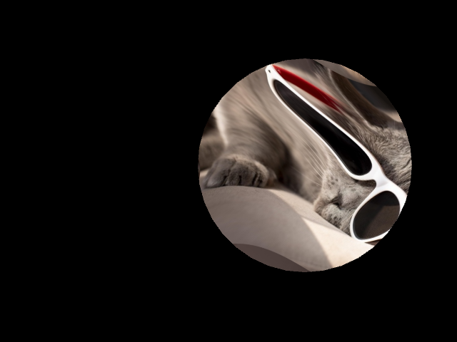

## Adding a custom vertex shader

So far, all examples have used the default vertex shader provided by Processing. However, *custom* vertex shaders can be created to manipulate vertex positions and pass additional data to the fragment shader, which can be used to create more complex effects. A custom vertex shader must be paired with a fragment shader when creating a `PShader` object via `loadShader()`. Much like a fragment shader runs once for every pixel on the screen, a vertex shader runs once for every vertex defined in the geometry being drawn. For example, running a vertex shader on a rectangle shape will execute four times (once for each corner vertex), while a circle shape with 36 segments will run the vertex shader 36 times (once for each vertex around the circle). The shader program executes at the moment the geometry is drawn to the screen.

Using the last example as a starting point, a custom vertex shader is added to manipulate the vertex positions of the circular shape. The following example introduces a displacement effect to the circle's vertices based on their position, rather than via texture sampling as seen in the prior fragment shader example. The effect is similar in that the original image becomes warped, but here it's because the *vertices* are moving, not the *sampling location* in the fragment shader. To add a custom vertex shader, create a new file named `vert.glsl` and load it alongside the fragment shader in the Processing sketch, and pass both into the `loadShader()` function, fragment shader first.

The default Processing vertex shader when dealing with textures is [here](https://github.com/processing/processing4/blob/main/core/src/processing/opengl/shaders/TexVert.glsl), and this is what the following example modifies. There are several new uniforms, attributes, and varying variables that are used to pass data between the vertex and fragment shaders and help the vertex shader understand how to position vertices on screen.

Note that any custom uniform set on the `PShader` object via `set()` in either the vertex or fragment shader is available to both, provided the uniform is declared in the shader code. This is a convenient way to potentially add interactivity to both shaders at once.

```java
PImage img;
PShader myShader;

void setup() {
  size(640, 480, P2D);
  img = loadImage("cool-cat.jpg");
  myShader = loadShader("frag.glsl", "vert.glsl");
}

void draw() {
  background(0);

  // Update shader uniform and apply shader to the context 
  float displaceAmp = map(mouseX, 0, width, 0, 50);
  myShader.set("uDisplaceAmp", displaceAmp);
  myShader.set("uTime", (float) millis());
  shader(myShader);

  // draw a circle with custom UV coordinates
  noStroke();
  textureMode(NORMAL);
  beginShape();
  texture(img);
  int circleResolution = 36;
  float radius = 150;
  for (int i = 0; i <= circleResolution; i++) {
    // calculate vertex positions around circle
    float angle = TWO_PI * i / circleResolution;
    float x = width/2 + cos(angle) * radius;
    float y = height/2 + sin(angle) * radius;
    
    // map UVs to circle shape
    // and correct for image aspect ratio, so the image doesn't look squished
    float aspect = float(img.width) / float(img.height);
    float u = 0.5 + cos(angle) * 0.5 / aspect;
    float v = 0.5 + sin(angle) * 0.5;
    
    // draw each vertex position and UV coords
    vertex(x, y, u, v);
  }
  endShape(CLOSE);
  
  resetShader();
}
```

```glsl
// vert.glsl
// processing-provided variables
uniform mat4 transformMatrix;
uniform mat4 texMatrix;

attribute vec4 position;
attribute vec4 color;
attribute vec2 texCoord;

varying vec4 vertColor;
varying vec4 vertTexCoord;

// custom variables
uniform float uDisplaceAmp;
uniform float uTime;


void main() {
  // apply transformations to vertex position
  vec4 newPosition = position;
  
  // Apply a sine wave distortion to the vertices' original positions (only the .xy components)
  // Important note: position is in screen space, rather than normalized UV space like in the fragment shader
  float frequency = 0.015; // use a lower frequency for position space distortion
  float phaseX = uTime * 0.005;
  float phaseY = uTime * 0.007;
  vec2 displace = vec2(
    cos(position.y * frequency + phaseX), 
    sin(position.x * frequency + phaseY)
  );
  newPosition.xy += displace * uDisplaceAmp;

  // set final vertex position and pass varying data to fragment shader
  gl_Position = transformMatrix * newPosition;

  // Pass vertex color and texture coordinate along to fragment shader
  // This is default behavior in Processing, and shows the pipeline between
  // geometry creation on the CPU, vertex shader application, and final
  // fragment shader rendering to the screen
  vertColor = color;
  vertTexCoord = texMatrix * vec4(texCoord, 1.0, 1.0);
}
```

```glsl
// frag.glsl
varying vec4 vertTexCoord;
uniform sampler2D texture;

void main() {
  // sample color from the image being drawn, 
  // based on geometry's custom UV coords
  vec2 uv = vertTexCoord.xy;

  // draw color to screen
  gl_FragColor = texture2D(texture, uv);
}
```

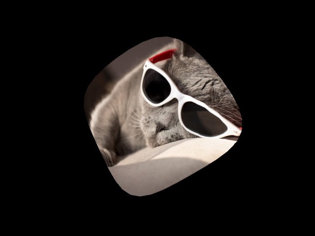

Note the following details in the first look at vertex shaders:

- Vertex positions are in their "screen space" coordinate system. For example, `vertex(200, 200)` creates a vertex that lives at 200, 200 in the vertex shader code too. This is a bit different than our normalized coordinates in the fragment shader.  
- Displacement of vertices also happens in screen space coordinates. This means that the distortion is based on the vertex positions on screen, which are in pixel dimensions, not normalized coordinates. By specifying a max displacement of 50, each vertex can move up to 50 pixels from its original location.
- The vertices in the example are the outer points of a circle, so displacing them creates a wavy circular shape. The inner pixels are filled in by the rasterization process, which fills in the gaps between vertices and their UV coordinates. This *interpolation* is what allows for smooth gradients and transitions between vertex positions and colors.
- The fragment shader isn't doing anything besides passing along the final pixel color to the canvas, based on the adjusted geometry. A fragment shader is always required when using a vertex shader.
- If an `int` is passed into a [`PShader.set()`](https://processing.org/reference/PShader_set_.html) function that connects to a `float` uniform in GLSL, things can break! This is why the Java `millis()` value is cast to a `float` when setting the `uTime` uniform.
- Finally, there are some new concepts to learn about how data is passed between Processing and GLSL, and between the vertex and fragment shaders themselves. In the vertex shader, there are several new variables that are automatically provided by Processing to help understand the geometry being drawn.
  - `transformMatrix` and `texMatrix` are 4×4 matrices that help position and match the UV coordinates to the vertex on screen, based on Processing's current transformations (like `translate()`, `rotate()`, and `scale()`). This matrix is multiplied by the vertex position to get the final screen position.
  - `position` is an attribute that contains the vertex's position in screen space. An `attribute` is a variable that is set on each vertex as the geometry is drawn. When `vertex()` is called in Processing, a vertex `attribute` is created behind the scenes for each vertex's position. This is how the position is accessible in the vertex shader.
  - `color` is another attribute that contains the vertex's color. In this example, the color isn't set explicitly, so it defaults to white. But in following examples, this attribute can be used to pass color data from the CPU to the GPU on a per-vertex basis.
  - `texCoord` is the UV coordinate that was assigned to the vertex when `vertex(x, y, u, v)` was called. This is how custom UV coordinates are passed from the CPU to the GPU. Primitive shapes like `rect()` and `sphere()` have default UV coordinates that are assigned automatically.
  - Both `color` and UV coordinates (`texCoord`) are passed to the fragment shader via `varying` variables. A `varying` variable is used to pass data from the vertex shader to the fragment shader. The GPU automatically interpolates these values between vertices for each pixel that is drawn, which allows for smooth transitions across the surface of the shape.

### The full rasterization pipeline explained: from CPU to Vertex Shader to Fragment Shader to screen

When the vertex and fragment shader are applied to the global graphics context with the `shader` function, the following process occurs:
- Each vertex defined by `vertex()` (or other drawing functions) is processed by the vertex shader, which can modify its position and accompanying data like color and UV coordinates. The vertex shader can also create custom numeric data to pass to the fragment shader via `varying` variables.
- The GPU then performs **rasterization**, which determines which pixels on screen are covered by the shape defined by the vertices. During this process, the GPU interpolates the `varying` variables (like UV coordinates and color) across the pixels within the shape, calculating smooth transitions based on the values at each vertex.
- Finally, the fragment shader executes once for each pixel. It uses the interpolated data to determine the final pixel color, whether by sampling a texture, blending between vertex colors, or performing custom color calculations.

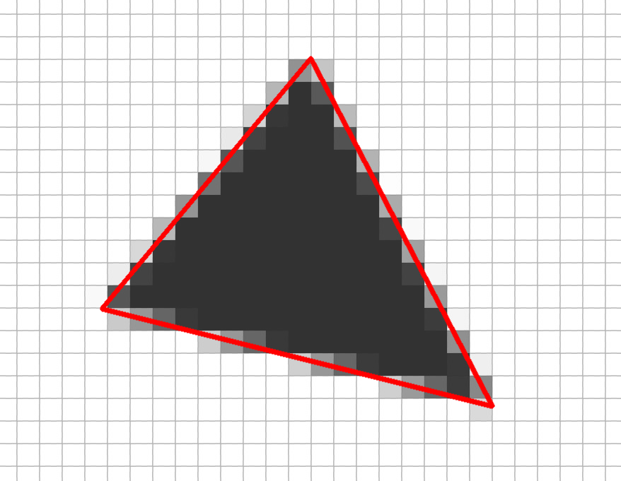

## Using vertex colors instead of texture sampling

In the next example, texture data is put aside for another look at how vertices can contain color data. By setting the fill color before calling `vertex()`, each vertex is assigned its own color `attribute`. This color data is then passed to the fragment shader via a `varying` variable. Note that the `color` varying is defined exactly the same way in both shader files. The default shaders in Processing simply pass this data along, leading to smooth interpolation of gradients and texture mapping between vertices. If the shaders are customized, the vertex color data can be manipulated in interesting (and very efficient) ways.

In the following example, the vertex shader modifies the original vertex colors based on their distance from the mouse position. Vertices closer to the mouse become brighter, while those further away remain unchanged. The fragment shader passes along the adjusted color to the screen. While previous examples have shown color calculations in the fragment shader, this example shows the possibility of manipulating colors in the vertex shader. It also demonstrates more intricate interactivity by using the mouse position to influence individual vertex colors.

If textures aren't being used, the shaders become slightly simplified. The texture shader code is additive to color shaders, so if textures aren't needed, some texture-related code can be removed. The default color vertex shader in Processing is [here](https://github.com/processing/processing4/blob/main/core/src/processing/opengl/shaders/ColorVert.glsl). This is a great starting point to create custom shaders. 

```java
PImage img;
PShader myShader;

void setup() {
  size(640, 480, P2D);
  myShader = loadShader("frag.glsl", "vert.glsl");
}

void draw() {
  background(0);

  // Update shader uniform and apply shader to the context 
  myShader.set("uMouse", (float) mouseX, (float) mouseY);
  shader(myShader);

  // Draw a rectangle with a different fill color on each vertex
  // Colors here mimic the "UV map" so the interpolation between
  // vertices is clearly illustrated
  noStroke();
  beginShape();
  // black at top-left corner
  fill(0, 0, 0);
  vertex(width * 0.2, height * 0.2, 0, 0);
  // green at top-right corner
  fill(255, 0, 0);
  vertex(width * 0.8, height * 0.2, 1, 0);
  // yellow at bottom-right corner
  fill(255, 255, 0);
  vertex(width * 0.8, height * 0.8, 1, 1);
  // green at bottom-left corner
  fill(0, 255, 0);
  vertex(width * 0.2, height * 0.8, 0, 1);
  endShape(CLOSE);
  
  resetShader();
}
```

```glsl
// vert.glsl
// processing-provided variables
uniform mat4 transformMatrix;

attribute vec4 position;
attribute vec4 color;

varying vec4 vertColor;

// custom uniforms
uniform vec2 uMouse;

void main() {
  gl_Position = transformMatrix * position;

  // Calculate distance between mouse and vertex position
  float dist = distance(uMouse, position.xy);

  // Use distance to modify vertex color's rgb components - closer vertices are brighter
  // Create a new `finalColor` variable to hold the adjusted color, since attributes are read-only
  float maxDist = 200.;
  float brightness = 1.0 - dist / maxDist;
  brightness = clamp(brightness, 0.0, 1.0); // clamp is like Processing's constrain()
  vec4 finalColor = color; // copy original color
  finalColor.xyz += vec3(brightness);

  // adjust the original vertex color and pass to fragment shader
  vertColor = finalColor;
}
```

```glsl
// frag.glsl
varying vec4 vertColor;

void main() {
  gl_FragColor = vertColor;
}
```

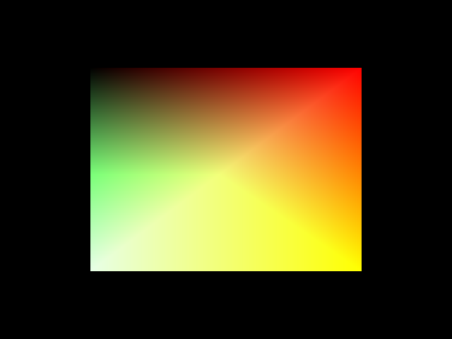

Processing's inner workings are revealed by looking into how shaders apply to vertices, colors, and texture mapping. There's a lot of magic that happens when vertex() is called, and shaders are at work whether the developer is aware of it or not. By creating custom shaders, the developer gains full control over this pipeline, allowing for unique visual effects and optimizations that go beyond Processing's built-in capabilities.

## Adding a third dimension with Z coordinates

So far, all examples have used 2D coordinates for vertex positions. However, Processing's P3D renderer supports 3D coordinates as well. By adding a Z coordinate to the `vertex()` function (or by manipulating vertex positions in the vertex shader), depth can be introduced to the geometry.

In the following example, the vertex shader is used to generate all of the color, which also corresponds to z-position displacement on a grid of rectangles. In this case, no color or depth information is provided when the shape is created on the CPU - it's all generated in the vertex shader based on each vertices position.

Note that when using 3D coordinates, the Processing sketch must use the P3D renderer by specifying `size(width, height, P3D);` in `setup()`. This also allows 3d transformations like `rotateX()` and `rotateY()` to view the 3D geometry from different angles.

```java
PShader myShader;

void setup() {
  size(640, 480, P3D);
  myShader = loadShader("frag.glsl", "vert.glsl");
}

void draw() {
  background(0);
  
  // set center of screen as 3d world origin
  translate(width/2, height/2, -100);
  rotateX(map(mouseY, 0, height, PI, -PI));
  rotateY(map(mouseX, 0, width, -PI, PI));

  // Update shader uniform and apply shader to the context 
  myShader.set("uTime", (float) millis());
  myShader.set("uDisplaceAmp", 100.0);
  shader(myShader);

  // Draw a subdivided mesh grid
  // The shader will displace vertices in Z based on their position
  fill(255);
  noStroke();
  float cellSize = 10;
  int cols = floor(width / cellSize);
  int rows = floor(height / cellSize);

  for(int row = 0; row < rows; row++) {
    for(int col = 0; col < cols; col++) {
      float x = col * cellSize - width / 2;
      float y = row * cellSize - height / 2;
      rect(x, y, cellSize, cellSize);
    }
  }
  
  resetShader();
}
```

```glsl
// vertex.glsl
// processing-provided variables
uniform mat4 transformMatrix;

attribute vec4 vertex;
attribute vec3 normal;

varying vec4 vertColor;

// custom uniforms
uniform float uTime;
uniform float uDisplaceAmp;

void main() {
  // Calculate distance from center of world 
  // in original xy coords
  float dist = distance(vec2(0.), vertex.xy);
  dist *= 0.05;

  // sin function for circular wave, normalized & offset over time
  float phaseOffset = uTime * -0.003;
  float sinAmp = 0.5 + 0.5 * sin(phaseOffset + dist);

  // Use the sin amplitude to also create the vertex color 
  // and pass to fragment shader to match displacement
  vec4 finalColor = vec4(vec3(sinAmp), 1.);
  vertColor = finalColor;

  // Apply displacement in object space along Z axis
  // using the normal direction, which orients properly
  vec4 displacedvertex = vertex;
  displacedvertex.xyz += normal * (sinAmp * uDisplaceAmp); 
  gl_Position = transformMatrix * displacedvertex;
}
```

```glsl
// frag.glsl
varying vec4 vertColor;

void main() {
  gl_FragColor = vertColor;
}
```

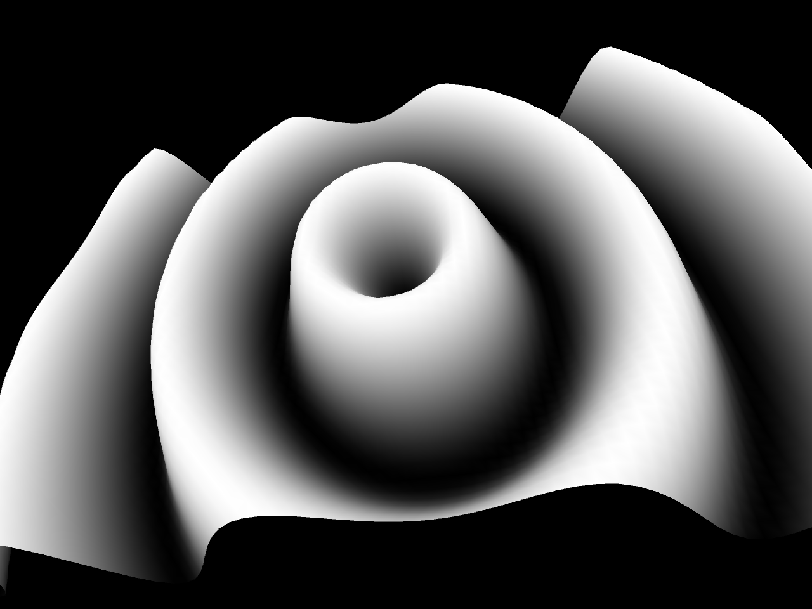

This shader code demonstrates some notable concepts:

<!--
🚨 TODO: explain output

New concepts:
- camera rotation impacting vertex positions
- this example makes it look like there's lighting, but using custom shaders basically disables all built-in lighting, unless you re-implement it yourself. This is possible if you start with the texlight shader, or implement a custom lighting model
- object space vs. world space vs. screen space
- position is in screen space, rather than normalized UV space like in the fragment shader
- there's a lot more to keep in mind with vertex shaders in 3D
- next example could show PShape and how they behave differently
-->

* The `normal` attribute is used to determine the natural "direction" of each vertex. In this case, since the geometry is made of flat rectangles, the normals point straight out along the Z-axis and can be used to displace the vertices in that direction. Normals are an important concept in 3D graphics, often used for lighting calculations. In the examples so far, vertices can contain lots of useful data as attributes, including position, color, texture coordinates, and normals. Depending on the geometry being drawn, there are conventions for the direction of normals. Normals typically point perpendicular to the surface for flat shapes like rectangles and outward from the center of a sphere. See the diagrams below for reference. When primitive shapes are drawn in Processing, normals are supplied by the built-in shape functions, which can then be used in the vertex shader. When building custom geometry (with `vertex()` calls, for example), custom normals can be created with [`normal()`](https://processing.org/reference/normal_html).
* `gl_Position` in a vertex shader is just like `gl_FragColor` in a fragment shader—it's the final output of the shader program. In this example, the vertex position is modified before being assigned to `gl_Position`, which changes where the vertex appears on screen. The original `vertex` attribute is read-only, so a new `displacedvertex` variable is created to store and adjust the modified position.

_Typical normals of a rectangle_:

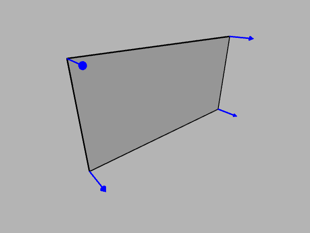

_Typical normals of a sphere_:

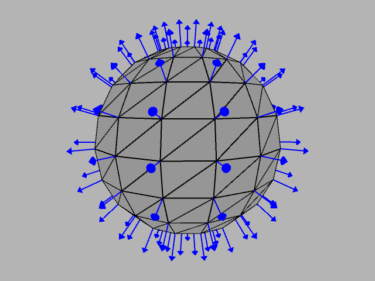

## GLSL math functions

As seen in the previous example, `distance()` and `sin()` are built-in GLSL math functions. Because GLSL is designed for graphics programming, it includes many useful functions for vector math, trigonometry, and more. Some of these functions should be familiar from Processing's own math and `PVector` functions, while others may be unique. The table below shows some of the overlapping math functions that are common to both Processing and GLSL. Many of GLSL's math functions are overloaded to work with both scalar values (like `float`) and vector types (like `vec2`, `vec3`, and `vec4`), which makes them very flexible.

> Common math functions in Processing and their GLSL equivalents:

| Processing             | GLSL                |
|------------------------|---------------------|
| `sin()`                | `sin()`             |
| `cos()`                | `cos()`             |
| `tan()`                | `tan()`             |
| `exp()`                | `exp()`             |
| `sqrt()`               | `sqrt()`            |
| `round()`              | `round()`           |
| `floor()`              | `floor()`           |
| `min()`                | `min()`             |
| `max()`                | `max()`             |
| `abs()`                | `abs()`             |
| `lerp()`               | `mix()`             |
| `constrain()`          | `clamp()`           |
| `dist()`               | `distance()`        |

The popular `map()` function in Processing does not have a direct equivalent in GLSL but can be implemented from scratch:

```glsl
float map(float value, float inputMin, float inputMax, float outputMin, float outputMax) {
  return outputMin + (outputMax - outputMin) * ((value - inputMin) / (inputMax - inputMin));
}
```

<!--
## Texture-sampling techniques in 3d

Next example:
- Texture sampling to deform a grid of rectangles in 3D space (takes the prior example one step forward)
-->

## Spherical texturing and deformation with PShape

The next example reintroduces texture sampling in 3D space, combined with vertex displacement in a custom vertex shader. Both the vertex and fragment shaders sample the texture image, but for different purposes. The vertex shader samples the texture to determine how much to displace each vertex along its normal, while the fragment shader samples the texture to determine the final pixel color. The result is a bumpy sphere effect, where the texture image drives the vertex displacement.

```java
PImage img;
PShader myShader;
PShape globe;

void setup() {
  size(640, 480, P3D);
  img = loadImage("moon-nasa.jpg");

  // load shader and set on context
  // no need to resetShader() later since we're only drawing with the shader
  myShader = loadShader("frag.glsl", "vert.glsl");
  shader(myShader);
  
  // build a texture-mapped sphere using PShape
  sphereDetail(80); // increase detail for smoother sphere
  globe = createShape(SPHERE, 150);
  globe.setTexture(img);
  globe.setStroke(color(0, 0)); // invisible stroke
}

void draw() {
  background(0);

  // set center of screen as 3d world origin
  translate(width/2, height/2, -100);

  // rotate based on mouse position
  rotateX(map(mouseY, 0, height, PI, -PI));
  rotateY(map(mouseX, 0, width, -PI, PI));

  // Update shader uniform and activate shader
  myShader.set("uDisplaceAmp", map(sin(millis() * 0.001), -1, 1, 0, 0.75));

  // draw the textured sphere with displacement
  shape(globe);
}
```

```glsl
// vertex.glsl
// processing-provided variables
uniform mat4 transformMatrix;
uniform mat4 texMatrix;
uniform sampler2D texture;

attribute vec4 position;
attribute vec2 texCoord;

varying vec4 vertTexCoord;

// custom uniforms
uniform float uDisplaceAmp;

void main() {
  // sample texture color at the vertex's UV coordinate
  vec4 texColor = texture2D(texture, texCoord.xy);

  // for a sphere, displace vertex position based on texture's red channel
  vec3 positionDisplaced = position.xyz;
  positionDisplaced.xyz *= 1. + uDisplaceAmp * texColor.r;
  gl_Position = transformMatrix * vec4(positionDisplaced, position.w);

  // pass texture coordinates to fragment shader
  vertTexCoord = texMatrix * vec4(texCoord, 1.0, 1.0);
}
```

```glsl
// frag.glsl
varying vec4 vertTexCoord;
uniform sampler2D texture;

void main() {
  // sample color from the image being drawn, 
  // based on geometry's custom UV coords
  vec2 uv = vertTexCoord.xy;

  // draw color to screen
  gl_FragColor = texture2D(texture, uv);
}
```

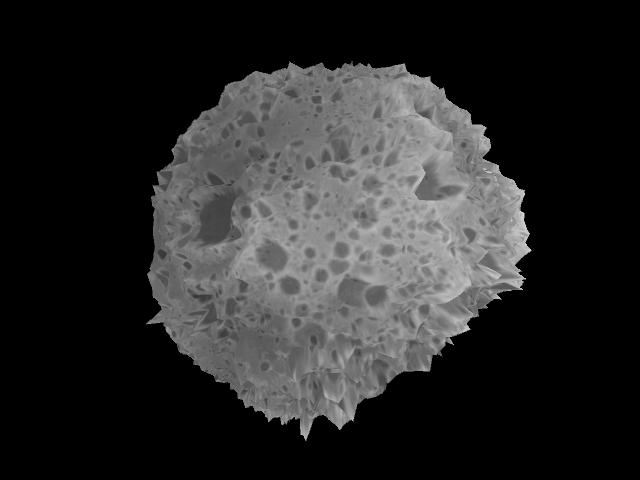

This example demonstrates several important concepts about working with spherical geometry and textures:

* **PShape** is used to create *cached geometry*, which is significantly more efficient than calling `sphere()` or manually creating vertices every frame. The PShape object has its own [tutorial](https://processing.org/tutorials/pshape) and is a great pairing with custom shaders, as both tools take advantage of GPU efficiencies.
* The `sphereDetail()` function controls the resolution of the sphere mesh. Higher detail values create more vertices, which results in a smoother sphere and more accurate displacement, but at the cost of performance.
* When `setTexture()` is called on a PShape object, the texture is automatically bound to the `texture` uniform in the shader. This is similar to how the `texture` uniform is automatically populated when calling `filter()` with a shader.
* **Equirectangular spherical images** are a special type of texture that appears stretched horizontally at the poles when viewed as a flat image. However, when mapped to a sphere using spherical UV coordinates, the stretching is reversed as the top and bottom edges of the image are "pinched" into single points at the sphere's poles. The [moon texture](https://svs.gsfc.nasa.gov/4720) used in this example is an equirectangular projection.
* In the vertex shader, displacement is calculated by multiplying the vertex position by an amplitude factor derived from the texture's red channel. Since the PShape sphere geometry is centered at the origin, scaling the position vector effectively moves each vertex outward along its normal direction without needing to use normals directly. 

🚨 **Next:**

## Lighting and normals

Do we need to talk about lighting and normals here?

## POINTS example

w/texture sampling in frag shader to color points